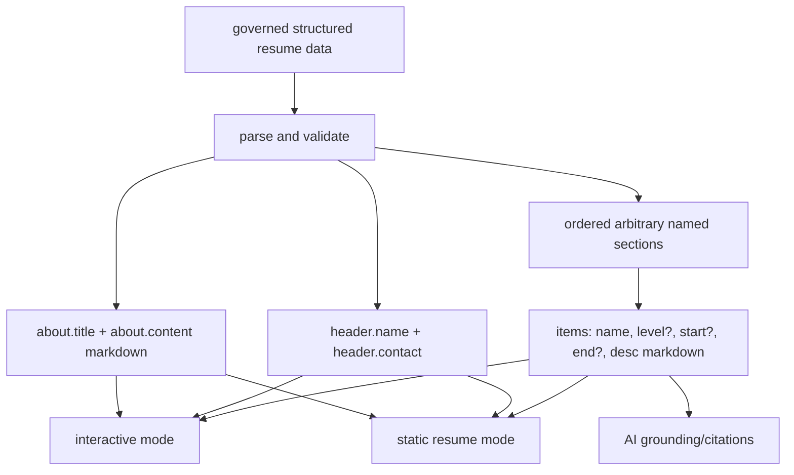
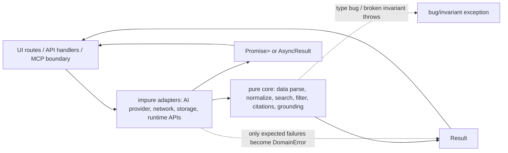

## Proposal: Specify predecessor interactive and static resume parity

### Target specification files

- SPECIFICATION/spec.md
- SPECIFICATION/contracts.md
- SPECIFICATION/scenarios.md
- SPECIFICATION/constraints.md

### Summary

The current spec says the app MUST preserve the core concept of ../interactive-resume.gitlab.io, but it is silent about most of the predecessor's concrete behavior: its structured data shape, sticky control bar, live fuzzy search, contents anchors, skill-level filters, per-section sorting, collapsible sections, reset semantics, markdown/date rendering, loading/error states, browser metadata, and static-generation parity. This ambiguity allows a new implementation to satisfy the broad words while losing major predecessor workflows.

### Motivation

This is critique-worthy because the predecessor implementation is the authoritative domain reference the user named, and the accepted spec is currently ambiguous and incomplete enough that it cannot drive a faithful implementation. The old app's own code and tests specify many behaviors the new spec does not capture.

### Proposed Changes

Add a dedicated predecessor-parity section across the functional spec files.

In `SPECIFICATION/spec.md`, require the canonical governed resume data to preserve the predecessor's conceptual data model unless a later proposed change explicitly migrates it. The model MUST include `about.title`, markdown `about.content`, `header.name`, `header.contact`, and an ordered set of arbitrary named resume sections derived from the remaining top-level data groups. Each section MUST contain ordered items with at least `name`, optional `level`, optional `start`, optional `end`, and markdown `desc`. The production content imported from the predecessor MUST preserve the predecessor's concrete section inventory unless intentionally revised: Job History, Formal Education, Open-Source Projects Created/Contributed, Writings/Publications/Presentations/Awards, Skills/Tools section families, Favorite Books/Articles, and Personal Info.



In `SPECIFICATION/contracts.md`, replace the vague interactive rendering contract with explicit UI and state contracts. Interactive mode MUST render a first-screen layout equivalent to:

```text
+--------------------------------------------------------------+
| sticky nav: [search] [Contents] [Skill Levels] [Reset] ...   |
|                                          [Instructions][About]|
+--------------------------------------------------------------+
| centered header: name                                        |
| centered header: contact                                     |
+--------------------------------------------------------------+
| section header: [collapse arrow] Section Name       sort: [] |
| row: item name + level | dates | markdown description        |
| row: ...                                                    |
+--------------------------------------------------------------+
| next section ...                                             |
+--------------------------------------------------------------+
```

The nav MUST include live search, Contents, Skill Levels, Reset, Instructions, and About controls. Contents MUST list all resume sections in data order and link to stable section anchors. The implementation MUST preserve legacy `#list-<ordinal>` section anchors as aliases, or define deterministic redirects from those hashes to the new stable section identifiers. Hash navigation MUST wait until data loading/rendering completes and then reveal the target without hiding it under the sticky nav.

Search MUST be live and operate over governed item names plus the plain-text form of markdown descriptions. It MUST NOT match markdown syntax or HTML tags as searchable content. Clearing the query MUST restore the default section/item view. No-match queries MUST keep the visitor in interactive mode and show an explicit empty state for affected content.

Skill filtering MUST preserve the predecessor skill levels and visitor-facing explanations:

| Level | Meaning |
|---|---|
| `played` | I have played around with it for fun |
| `once` | I have used it on a single job or project |
| `often` | I have used it on multiple jobs or projects |
| `toolbox` | It's part of my toolbox; I use it daily |
| `teach` | I know it in depth, I could teach a workshop or class on it |
| `unspecified` | Unspecified |

The Skill Levels control MUST default to all levels selected, MUST allow toggling each level independently, and MUST explain the levels in the UI. Items with no level MUST behave as `unspecified`. Items with an invalid legacy level SHOULD remain visible and SHOULD expose an implementation-visible diagnostic rather than silently disappearing.

Each section MUST support independent sort state with at least these options: Default, Name Asc, Name Desc, Start Date Asc, Start Date Desc, End Date Asc, End Date Desc. Default preserves canonical data order. Name sorts compare item names. Date sorts use parsed start/end dates, use item-name tie-breakers, and treat missing end dates as current for end-date ordering. Invalid sort input MUST fall back to default order or be rejected before it mutates state.

Each section MUST be collapsible/expandable. Collapsed sections hide rows but keep the section header and anchor available. Reset MUST clear search text, select all skill levels, restore every section's default sort, expand collapsed sections, scroll to the top, and clear the hash/deep-link state.

Item rendering MUST preserve the predecessor semantics: item name, optional level badge/label with level explanation, date column, and markdown-rendered description. Dates MUST render month/year as `M.YYYY`; a missing start with present end MUST render `until`; a present start with missing end MUST render `current`; missing start and end MUST render the item as current. Markdown in `about.content` and item `desc` MUST render consistently in interactive and static modes, with sanitization rules documented before untrusted content is admitted.

Static resume mode MUST render the same governed profile/about/header/section/item data in the same canonical order, fully expanded, without requiring search, skill filters, collapse state, hover, chat, or JavaScript-only disclosure. Static mode MUST preserve markdown text, public links, visible URLs for printing/PDF, date formatting, item levels, and section names. Static mode MAY omit interactive controls, but it MUST not omit resume facts that interactive mode renders.

In `SPECIFICATION/scenarios.md`, add acceptance scenarios for: importing predecessor data shape; rendering About and Instructions controls; contents navigation to a legacy section hash after loading; live search over markdown-stripped descriptions; no-match search; skill-level filtering and level explanations; per-section sort options; section collapse/expand; reset restoring all interactive state; date formatting cases; markdown rendering; load failure; and static mode preserving all interactive resume facts in printable order.

In `SPECIFICATION/constraints.md`, specify the migration boundary from the old external YAML URL to the new in-repository governed data source. The new app MUST not depend at runtime on the sibling checkout or the old GitLab Pages data URL, but the implementation work MUST import or transcribe the predecessor's current production resume content into the governed source and preserve predecessor browser metadata where still applicable: page title `Chad Woolley - Resume`, viewport metadata, favicon/app icons or documented replacements, robots/canonical behavior, and no-horizontal-scroll responsive behavior.

## Proposal: Require Result and railway-oriented programming enforcement

### Target specification files

- SPECIFICATION/non-functional-requirements.md
- SPECIFICATION/constraints.md
- SPECIFICATION/contracts.md

### Summary

The current non-functional requirements require strict TypeScript and broad quality gates, but they are silent about the user's required Railway Oriented Programming discipline and Result object usage. This ambiguity means core parsing, filtering, grounding, AI, and MCP code can be implemented with unchecked throws, nullable sentinels, ignored promises, or ad hoc error objects while still appearing to satisfy the current spec.

### Motivation

This is critique-worthy because the user explicitly requires the same style of Result/ROP discipline that livespec uses, and livespec's own specification treats public Result typing, domain-error routing, impure-boundary wrapping, and aggregate-check enforcement as load-bearing architecture constraints. Without an enforceable TypeScript analogue, the requirement is undefined and unenforceable.

### Proposed Changes

Add this as a separate proposed change from predecessor functional parity.

In `SPECIFICATION/non-functional-requirements.md`, add a `### Result / ROP discipline` section requiring a local TypeScript Result abstraction. The repository MUST define or adopt a typed Result object with `Ok<T>` and `Err<E>` variants and helper composition functions for `map`, `mapErr`, `andThen`/`bind`, async composition, and exhaustive narrowing. The exact library or in-repo implementation MAY be chosen by implementation, but the public shape MUST be documented in `contracts.md` before use.



The requirement MUST distinguish expected domain failures from bugs:

| Category | Examples | Required routing |
|---|---|---|
| Domain error | invalid resume data, missing governed item, no search matches where represented as data outcome, AI provider unavailable, malformed provider response, unsupported MCP request, missing environment variable, rate limit, network timeout | `Err<DomainError>` on the Result track |
| Bug | impossible branch, type mismatch, null dereference, broken invariant, unhandled discriminant, programmer misuse of a dependency | thrown exception caught only by an outer supervisor/error boundary |

First-party public functions in core modules for resume data parsing, normalization, date formatting, markdown-to-text conversion, search, filtering, sorting, citation construction, grounding, AI response validation, and MCP contract shaping MUST return `Result<T, DomainError>` for synchronous logic. First-party public functions that perform asynchronous expected-failure work MUST return `Promise<Result<T, DomainError>>` or a documented `AsyncResult<T, DomainError>` alias. UI component event handlers MAY return framework-native `void` when they only dispatch to Result-returning application services and handle both variants before updating UI state.

Boundary adapter modules that call browser/server runtime APIs, network, storage, Vercel facilities, AI providers, or future MCP transports MUST convert only enumerated expected failures into `DomainError` variants. Blanket `catch (error) { return err(...) }` outside approved boundary adapters MUST be forbidden because it hides bugs as recoverable failures. Boundary adapters MAY catch unknown values only to classify them as expected provider/runtime failures after checking their type or shape; otherwise they MUST rethrow.

`DomainError` MUST be a discriminated union with stable `kind` strings and structured, non-secret context. It MUST NOT be a single catch-all `Error`, string, `unknown`, or nullable sentinel. User-facing errors MUST be derived from `DomainError.kind` through a presentation mapper that strips secrets, prompts, stack traces, filesystem paths, and raw provider payloads.

In `SPECIFICATION/contracts.md`, add a Result contract similar to:

```typescript
type Result<T, E> =
  | { ok: true; value: T }
  | { ok: false; error: E };

type AsyncResult<T, E> = Promise<Result<T, E>>;
```

The exact exported names MAY differ, but the contract MUST expose a discriminated success/failure object rather than exceptions or nullable values for expected failures.

In `SPECIFICATION/non-functional-requirements.md` and `constraints.md`, require `bun run check` to enforce the discipline mechanically with TypeScript/ESLint or repository-local AST checks. The aggregate check MUST include gates for: public API Result typing in the selected first-party core directories; no ignored Result/AsyncResult return values; no floating promises; exhaustive switches over `DomainError.kind`; no blanket catch outside approved adapters and supervisors; no throwing `DomainError` as an exception; and no direct rendering of raw `Error`/provider payloads to visitors. The checks MUST be local TypeScript/Bun/Vercel-compatible tooling and MUST NOT import livespec's Python enforcement suite, preserving the standalone boundary.

Add a small architecture diagram to the NFR so implementers know the intended layer split:

```text
src/data|domain|search|grounding|mcp-contracts  -> pure Result<T, DomainError>
src/adapters|server|api                         -> AsyncResult<T, DomainError>, enumerated expected catches
src/routes|components                            -> unwrap Result, render success/error states, no raw provider errors
```

This mirrors livespec's Result/IOResult architecture at the right level for a TypeScript resume app: the spec binds public error flow and enforcement gates, while leaving the exact internal composition primitive and library choice to implementation.
