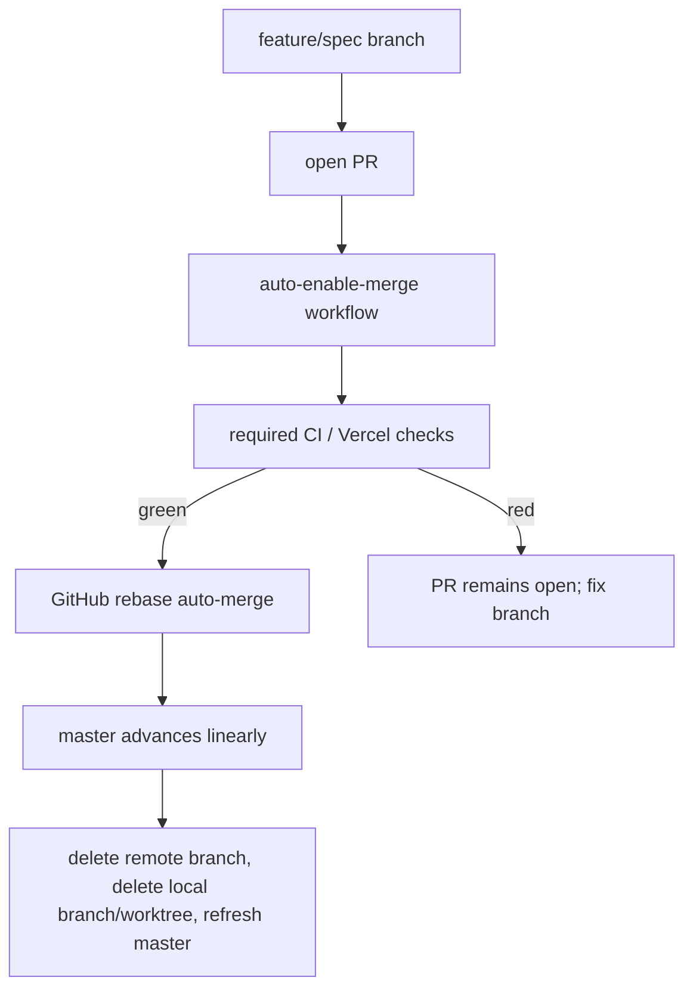

# AI-centric interactive resume - non-functional requirements

## Boundary

`non-functional-requirements.md` covers how this TypeScript resume app is built, tested, and maintained, including the contributor toolchain, repository command contracts, code-architecture discipline, and contributor-workflow scenarios. User-facing product behavior belongs in `spec.md`; browser, data, AI, and MCP contracts belong in `contracts.md`; runtime and architecture constraints visible to users or deployers belong in `constraints.md`; user-facing acceptance examples belong in `scenarios.md`.

The project intentionally adopts livespec fleet discipline without depending on livespec fleet repositories; the standalone rule is defined once in `constraints.md` §"Standalone boundary". Requirements in this file MUST be implemented with standalone TypeScript, Bun, Vercel, GitHub, and local repository tooling unless a future proposed change explicitly adds a dependency.

## Spec

### Livespec governance

The repository MUST remain livespec-first. Product, contract, constraint, and non-functional changes MUST flow through livespec proposed changes and revisions before implementation work relies on them. Implementation work MUST treat the accepted specification as authoritative and MUST update it before or with any behavior change.

The project MUST dogfood the livespec Codex driver and the git-jsonl orchestrator. The workflow MAY borrow practices from the wider livespec fleet. Work items SHOULD be tracked through the selected orchestrator once the repository is ready for implementation planning.

### Test-Driven Development discipline

Behavioral implementation work MUST follow Red -> Green -> Refactor. A feature or fix changeset MUST include a failing test that demonstrates the missing behavior before the implementation turns it green. Refactors MUST preserve the existing green suite.

For UI behavior, the preferred red test is a Playwright or integration test that observes user-visible behavior. For pure data transforms, search, grounding, and contract logic, the preferred red test is a Vitest unit or property test.

### Top-of-pyramid discipline

Every `## Scenario:` heading in `SPECIFICATION/scenarios.md` MUST be mapped to an end-to-end or integration test before the scenario is treated as implemented. Unit tests MAY support the implementation, but they do not satisfy scenario coverage by themselves.

This coverage gate applies only to `SPECIFICATION/scenarios.md`. Scenarios in this file's own "Scenarios" section are contributor-workflow scenarios and are satisfied by repository and CI configuration (for example, a required GitHub check wired to the aggregate check command), not by Playwright tests.

### Definition of done for implementation work

An implementation change is not done until the aggregate check command passes locally or the remaining failure is explicitly documented as external to the change. The aggregate check MUST include typechecking, linting, format checks, unit tests, integration tests when present, Playwright end-to-end tests, the Result/ROP enforcement gates in §"Result and railway-oriented programming discipline", and any spec or scenario coverage checks introduced by the project. Vercel production and preview constraints MUST remain satisfied before merge.

## Contracts

### Contributor toolchain

The preferred toolchain is TypeScript with Bun for package management and script execution, Vitest for unit and integration tests, Playwright for browser end-to-end tests, and Vercel for deployment. The repository MUST pin tool versions or otherwise document the version-selection mechanism so a fresh checkout can reproduce the same checks.

### Aggregate command

The canonical aggregate check command is `bun run check`. It MUST be non-mutating and MUST run the checks required by "Definition of done for implementation work". A `just check` wrapper MAY additionally be provided, but it MUST only delegate to `bun run check`. CI and hooks MUST delegate to the aggregate command or to documented subcommands rather than embedding divergent tool invocations.

### Package script categories

The repository SHOULD provide these command categories:

| Command category | Required behavior |
|---|---|
| Bootstrap | Install pinned dependencies and local hooks. |
| Dev server | Run the app locally. |
| Build | Produce the Vercel-deployable production build. |
| Typecheck | Run TypeScript checks. |
| Lint and format | Check style and formatting, with separate mutating fix commands. |
| Unit tests | Run fast unit tests. |
| End-to-end tests | Run Playwright scenarios against the app. |
| Aggregate check | Run all required non-mutating checks. |

### Exit-code baseline

Repository-owned CLIs and scripts that expose explicit process status MUST use this baseline unless a narrower tool's convention is documented:

| Code | Meaning |
|---|---|
| `0` | success |
| `1` | internal bug or unexpected tool failure |
| `2` | usage error or invalid command invocation |
| `3` | precondition failure such as missing environment, missing dependency, or invalid project state |

### GitHub CI and pull request discipline

GitHub CI MUST run the aggregate check for pull requests before merge. Pull requests SHOULD also validate the Vercel build path. Release or production-promotion workflows MUST be explicit and MUST NOT rely on undocumented local state.

### Pull request landing automation

Changes MAY land either by the repository owner committing directly to `master`, or through a pull request. Direct owner commits to `master` are a sanctioned path — the repository owner's standing preference — not an emergency-only exception. For changes that go through review, the repository targets an automated pull-request landing path so a green pull request lands without a manual merge/push sequence: branch -> pull request -> required checks -> rebase auto-merge -> cleanup.

For the pull-request path, the repository settings MUST allow rebase merge and MUST disable squash merge and merge commits, and the `master` branch MUST require linear history. This preserves every commit's Conventional Commit subject and avoids merge commits in the public history.

The `master` branch SHOULD have branch protection configured so the repository's full CI/check set is required before a pull request merges. When branch protection is configured, it MUST apply to administrators and MUST NOT enable GitHub's `strict` / require-branches-up-to-date setting: with `gh pr merge --auto`, strict mode can update a behind pull request by merging `master` into the branch, which violates linear history. Rebase merge already replays the pull request on the current `master` tip at merge time, and any semantic conflict is caught by the required checks on `master` after landing.

When the automated pull-request path is provisioned, the repository MUST carry `.github/workflows/auto-enable-merge.yml`. The workflow MUST trigger on pull request `opened`, `reopened`, `ready_for_review`, `synchronize`, and `unlabeled` events. It MUST skip draft pull requests and pull requests labeled `do-not-merge`. For eligible pull requests from the repository owner or an explicit allowlist of trusted automation identities, it MUST enable rebase auto-merge by running `gh pr merge "$PR" --repo "$REPO" --auto --rebase`. The workflow MUST use a short-lived GitHub App installation token minted at runtime, not `GITHUB_TOKEN`, because enabling pull-request auto-merge requires permissions that `github-actions[bot]` does not reliably have. The repository MUST document and provision the required secrets `APP_ID` and `APP_PRIVATE_KEY` before claiming the workflow is operational.

The repository MUST NOT add an auto-update-branches workflow or any equivalent mechanism that merges `master` into open pull-request branches. Behind pull requests are handled by rebase auto-merge at merge time, not by pre-merge branch-update commits.

The expected pull-request landing sequence is:



When the automated pull-request path is claimed operational, the aggregate check command SHOULD include a repository-local verification that `.github/workflows/auto-enable-merge.yml` exists and that branch-protection and merge-method settings are documented. If live GitHub API verification is added later, it MUST be a local or CI check that fails when required branch protection, linear history, or auto-merge workflow wiring is absent or misconfigured.

### Local memory guardrails

Repository automation and agent workflows MUST NOT persist private local memories in hidden tool state. If agent-facing local notes are needed, the repository MUST add `.ai/*.md` files and an `AGENTS.md` index. Hooks or checks SHOULD guard against persisting private local memories in unsupported locations once those conventions are introduced.

## Constraints

### TypeScript quality gates

TypeScript MUST run in strict mode. Linting and formatting MUST be enforced with TypeScript-native tools selected by the implementation. The linter configuration SHOULD include rules that catch unused code, unsafe promises, accidental `any`, import disorder, unreachable code, and test-only leakage into production bundles.

### Result and railway-oriented programming discipline

The repository MUST define or adopt a typed `Result` object with `Ok<T>` and `Err<E>` variants and helper composition functions for `map`, `mapErr`, `andThen`/`bind`, asynchronous composition, and exhaustive narrowing. The exact library or in-repo implementation MAY be chosen by the implementation, but the public shape MUST be documented in this file before use. A minimal documented shape is:

```typescript
type Result<T, E> =
  | { ok: true; value: T }
  | { ok: false; error: E };

type AsyncResult<T, E> = Promise<Result<T, E>>;
```

The exported names MAY differ, but the abstraction MUST expose a discriminated success/failure object rather than exceptions or nullable values for expected failures.

The discipline MUST distinguish expected domain failures from bugs:

| Category | Examples | Required routing |
|---|---|---|
| Domain error | invalid resume data, missing governed item, no search matches represented as a data outcome, AI provider unavailable, malformed provider response, unsupported MCP request, missing environment variable, rate limit, network timeout | `Err<DomainError>` on the Result track |
| Bug | impossible branch, type mismatch, null dereference, broken invariant, unhandled discriminant, programmer misuse of a dependency | thrown exception caught only by an outer supervisor or error boundary |

First-party public functions in core modules for resume data parsing, normalization, date formatting, markdown-to-text conversion, search, filtering, sorting, citation construction, grounding, AI response validation, and MCP contract shaping MUST return `Result<T, DomainError>` for synchronous logic. First-party public functions that perform asynchronous expected-failure work MUST return `Promise<Result<T, DomainError>>` or a documented `AsyncResult<T, DomainError>` alias. UI component event handlers MAY return framework-native `void` when they only dispatch to Result-returning application services and handle both variants before updating UI state.

Boundary adapter modules that call browser or server runtime APIs, network, storage, Vercel facilities, AI providers, or future MCP transports MUST convert only enumerated expected failures into `DomainError` variants. A blanket `catch (error) { return err(...) }` outside approved boundary adapters MUST be forbidden, because it hides bugs as recoverable failures. Boundary adapters MAY catch unknown values only to classify them as expected provider or runtime failures after checking their type or shape; otherwise they MUST rethrow.

`DomainError` MUST be a discriminated union with stable `kind` strings and structured, non-secret context. It MUST NOT be a single catch-all `Error`, string, `unknown`, or nullable sentinel. User-facing errors MUST be derived from `DomainError.kind` through the presentation mapper required by `contracts.md` §"Error payloads", which strips secrets, prompts, stack traces, filesystem paths, and raw provider payloads.

The intended layer split is:

```text
src/data|domain|search|grounding|mcp-contracts  -> pure Result<T, DomainError>
src/adapters|server|api                          -> AsyncResult<T, DomainError>, enumerated expected catches
src/routes|components                            -> unwrap Result, render success/error states, no raw provider errors
```

The aggregate check command (§"Aggregate command") MUST enforce this discipline mechanically with TypeScript, ESLint, or repository-local AST checks. The gates MUST include: public API Result typing in the selected first-party core directories; no ignored `Result`/`AsyncResult` return values; no floating promises; exhaustive switches over `DomainError.kind`; no blanket catch outside approved adapters and supervisors; no throwing `DomainError` as an exception; and no direct rendering of raw `Error` or provider payloads to visitors. Per `constraints.md` §"Standalone boundary", these checks MUST use local TypeScript/Bun/Vercel-compatible tooling and MUST NOT import livespec's Python enforcement suite.

### Test coverage expectations

Coverage thresholds MUST be explicit before the first non-trivial implementation merge. The project SHOULD aim for high line and branch coverage on first-party logic, with stricter expectations for pure data transforms, answer-grounding logic, and MCP contracts than for framework glue.

### Fuzzing and property checks

Pure parsing, normalization, search, filtering, citation, and grounding modules SHOULD have property-based or fuzz-style tests when the input space is broader than a few fixed examples. These tests MUST run without network access.

### Hooks

Local hooks SHOULD run fast checks before commit and the aggregate check before push when practical. Hooks MUST be reproducible from committed configuration.

### Vercel environment discipline

Environment variables MUST be documented by name, purpose, environment class, and whether they are required for local, preview, or production use. Production secrets MUST be stored in Vercel or another managed secret store, never in the repository.

### Dependency discipline

Runtime dependencies MUST be justified by product behavior. Development dependencies MUST support the standalone TypeScript toolchain per `constraints.md` §"Standalone boundary".

## Scenarios

### Scenario: Scenario coverage gate protects acceptance behavior

Given a scenario is added to `SPECIFICATION/scenarios.md`

When the implementation claims that scenario is complete

Then a Playwright or integration test maps to that scenario before merge

### Scenario: Aggregate check is the single local quality gate

Given a contributor has installed the documented toolchain

When they run the aggregate check command

Then typechecking, linting, formatting, tests, Result/ROP enforcement gates, and scenario coverage checks run through one documented entry point

### Scenario: Result discipline gate rejects unchecked error flow

Given first-party core code ignores a `Result` return value, floats a promise, uses a blanket catch outside an approved adapter, or renders a raw provider error to visitors

When the aggregate check command runs

Then the Result/ROP enforcement gate fails the check before merge

### Scenario: Preview deployment validates a pull request

Given a pull request changes product behavior

When CI and Vercel preview checks run

Then the aggregate check passes and the preview deployment renders the changed resume app before merge

### Scenario: Pull request lands automatically after required checks pass

Given a trusted contributor opens a non-draft pull request without the `do-not-merge` label

When the auto-enable-merge workflow runs and the required CI and Vercel checks pass

Then GitHub rebase-merges the pull request to `master` without a manual local merge or direct push

### Scenario: Red pull request cannot land

Given a pull request has failing required checks

When GitHub evaluates mergeability for `master`

Then branch protection blocks the merge until the required checks pass
