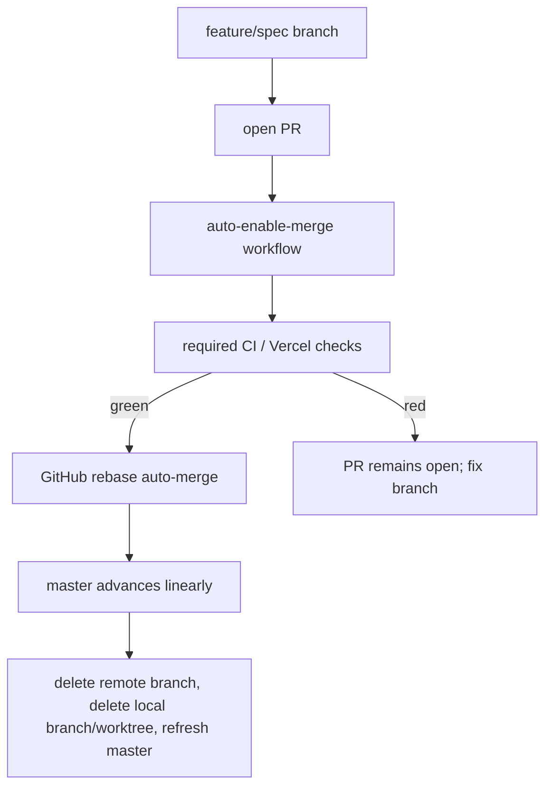

## Proposal: Automate PR landing through rebase auto-merge

### Target specification files

- SPECIFICATION/non-functional-requirements.md

### Summary

Add a non-functional requirement that this repository follows livespec's PR landing discipline: every change lands through a PR, GitHub branch protection makes CI a required merge gate, GitHub repository settings allow only rebase merges with linear history, and an auto-enable-merge workflow puts eligible PRs into `gh pr merge --auto --rebase` automatically so green PRs land without a manual merge/push sequence.

### Motivation

The current workflow is painful because landing a completed PR still depends on a human or agent remembering the correct sequence after opening the PR. livespec avoids that by combining branch protection, rebase-merge-only repository settings, and an `auto-enable-merge.yml` workflow that uses a GitHub App token to run `gh pr merge --auto --rebase` for eligible PRs. The resume spec currently says only that CI runs before merge, which is ambiguous and does not require any automatic landing path.

### Proposed Changes

In `SPECIFICATION/non-functional-requirements.md`, add a new subsection under `## Contracts` after `### GitHub CI and pull request discipline`, or expand that subsection, with normative language equivalent to the following:

### Pull request landing automation

Every tracked-file change MUST land through a pull request unless the user explicitly asks for an emergency direct-to-master operation. The normal repository flow MUST be branch -> pull request -> required checks -> rebase auto-merge -> cleanup. Direct local fast-forwarding of `master` from a feature branch is not the normal landing path.

The GitHub repository settings MUST allow rebase merge and MUST disable squash merge and merge commits. The `master` branch MUST require linear history. This preserves every commit's Conventional Commit subject and avoids merge commits in the public history.

The `master` branch MUST have branch protection configured so that the repository's full CI/check set is required before merge. Branch protection MUST apply to administrators. Branch protection MUST NOT enable GitHub's `strict` / require-branches-up-to-date setting: with `gh pr merge --auto`, strict mode can update a behind PR by merging `master` into the branch, which violates linear history. Rebase merge already replays the PR on the current `master` tip at merge time; any semantic conflict is caught by the required checks on `master` after landing.

The repository MUST carry `.github/workflows/auto-enable-merge.yml`. The workflow MUST trigger on pull request `opened`, `reopened`, `ready_for_review`, `synchronize`, and `unlabeled` events. It MUST skip draft PRs and PRs labeled `do-not-merge`. For eligible PRs from the repository owner or an explicit allowlist of trusted automation identities, it MUST enable rebase auto-merge by running `gh pr merge "$PR" --repo "$REPO" --auto --rebase`.

The auto-enable-merge workflow MUST use a short-lived GitHub App installation token minted at runtime, not `GITHUB_TOKEN`, because enabling pull-request auto-merge requires permissions that `github-actions[bot]` does not reliably have. The repository MUST document and provision the required secrets `APP_ID` and `APP_PRIVATE_KEY` before claiming the workflow is operational.

The repository MUST NOT add an auto-update-branches workflow or any equivalent mechanism that merges `master` into open PR branches. Behind PRs are handled by rebase auto-merge at merge time, not by pre-merge branch-update commits.

The expected landing sequence for agents and humans MUST become:



Add a contributor-workflow scenario in this same NFR file:

```gherkin
### Scenario: Pull request lands automatically after required checks pass

Given a trusted contributor opens a non-draft pull request without the `do-not-merge` label

When the auto-enable-merge workflow runs and the required CI and Vercel checks pass

Then GitHub rebase-merges the pull request to `master` without a manual local merge or direct push
```

Add another contributor-workflow scenario:

```gherkin
### Scenario: Red pull request cannot land

Given a pull request has failing required checks

When GitHub evaluates mergeability for `master`

Then branch protection blocks the merge until the required checks pass
```

The aggregate check command SHOULD include a repository-local verification that `.github/workflows/auto-enable-merge.yml` exists and that branch-protection/merge-method settings are documented. If live GitHub API verification is added later, it MUST be a local or CI check that fails when required branch protection, linear history, or auto-merge workflow wiring is absent or misconfigured.
