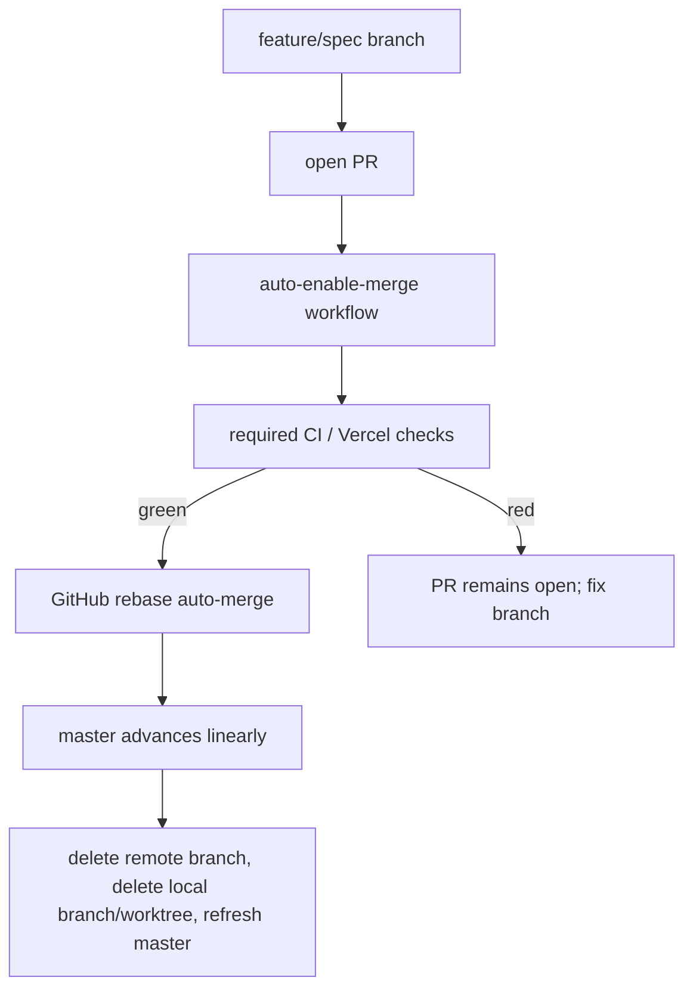

# AI-centric interactive resume - non-functional requirements

## Boundary

`non-functional-requirements.md` covers how this TypeScript resume app is built, tested, and maintained, including the contributor toolchain, repository command contracts, code-architecture discipline, release discipline, and contributor-workflow scenarios. User-facing product behavior belongs in `spec.md`; browser, data, AI, and MCP contracts belong in `contracts.md`; runtime and architecture constraints visible to users or deployers belong in `constraints.md`; user-facing acceptance examples belong in `scenarios.md`.

The project intentionally adopts livespec fleet discipline without depending on livespec fleet repositories; the standalone rule is defined once in `constraints.md` §"Standalone boundary". Requirements in this file MUST be implemented with standalone TypeScript, Svelte, Bun, Vercel, GitHub, and local repository tooling unless a future proposed change explicitly adds a dependency.

## Spec

### Livespec governance

The repository MUST remain livespec-first. Product, contract, constraint, and non-functional changes MUST flow through livespec proposed changes and revisions before implementation work relies on them. Implementation work MUST treat the accepted specification as authoritative and MUST update it before or with any behavior change.

The project MUST dogfood the livespec Codex driver and the git-jsonl orchestrator. Work items SHOULD be tracked through the selected orchestrator once the repository is ready for implementation planning.

### Discipline adoption inventory

Before implementation planning claims the livespec fleet discipline has been adopted, the repository MUST maintain a local discipline-adoption inventory at `.ai/discipline-adoption.md`. The root `AGENTS.md` index MUST reference that file once it exists, per §"Local memory guardrails".

The inventory MUST contain a table with at least these columns: discipline, source inspiration, disposition, enforcement class, local enforcement artifact, aggregate-check coverage, and notes. The disposition value MUST be exactly one of adopted, locally adapted, deferred, or rejected. The enforcement class MUST be exactly one of gate-enforced, process-enforced, documented-only, or none.

Gate-enforced rows MUST cite a local TypeScript, Svelte, Bun, Vercel, GitHub, hook, or CI command/workflow that fails when the practice is violated. Process-enforced rows MUST cite a committed workflow artifact, such as a pull request convention, work-item record, or commit-evidence convention, that records the practice and is checked by a local or CI gate for presence and shape even when the practice's historical ordering cannot be reconstructed from a single final tree. Documented-only rows MAY cite documentation, but MUST NOT be described as enforced and MUST record why no gate or process-enforcement mechanism exists. Deferred and rejected rows MUST use enforcement class none, state the reason, and state the condition for revisiting the decision.

The inventory MUST include baseline rows for every seed-listed discipline: TDD, livespec-dev-tooling-inspired shared guidelines, applicable livespec ecosystem tooling, GitHub CI and pull-request discipline, release discipline, top-of-pyramid E2E discipline, linting, fuzzing and property checks, local memory guardrails, standalone dependency boundaries, Bun/Vitest/Playwright/Svelte/SvelteKit/Vercel toolchain discipline, and git-jsonl work-item workflow.

The inventory MUST preserve the standalone boundary: adopted discipline MAY be inspired by sibling livespec repositories, but runtime code, tests, CI, hooks, build scripts, and deployment MUST NOT require sibling checkouts, Python-only fleet tooling, or non-committed local state. `bun run check` MUST verify that `.ai/discipline-adoption.md` exists before the first non-trivial implementation merge, that it contains the baseline rows above, that each row uses an allowed disposition and enforcement class, that gate-enforced rows cite existing runnable local commands, hooks, or workflows, that process-enforced rows cite existing committed workflow evidence, work-item records, or pull-request/commit conventions checked for presence by a local or CI gate, and that documented-only rows are not counted or described as enforced.

The locally adopted livespec-dev-tooling-inspired shared guidelines are the committed local rules in this file, not an implicit dependency on a sibling checkout. The baseline row for livespec-dev-tooling-inspired shared guidelines MUST cite this section and map at least these local guidelines to their local enforcement artifacts: one aggregate check command as the single gate; the exit-code baseline for repository-owned CLIs; Result/ROP error-flow discipline; hermetic no-network property/fuzz checks for broad input spaces; pinned and reproducible TypeScript/Svelte/Bun/Vercel tooling; local memory guardrails; and the standalone dependency boundary. Any additional guideline inspired by livespec-dev-tooling MUST be enumerated here or in an indexed `.ai/*.md` note before the inventory may mark it adopted or locally adapted.

### Test-Driven Development discipline

Behavioral implementation work MUST follow Red -> Green -> Refactor. A feature or fix changeset MUST include a failing test that demonstrates the missing behavior before the implementation turns it green. Refactors MUST preserve the existing green suite.

For UI behavior, the preferred red test is a Playwright test that observes user-visible behavior. A lower-level integration test MAY support the red test, but it MUST NOT replace the required Playwright mapping for a load-bearing functional scenario in `SPECIFICATION/scenarios.md`. For pure data transforms, search, grounding, and contract logic, the preferred red test is a Vitest unit or property test.

TDD is process-enforced with a repository-local evidence gate. Before the first non-trivial implementation merge, `bun run check` MUST include a TDD evidence check that fails a feature or fix changeset touching first-party implementation code unless the same changeset includes both test changes and a committed or pull-request-visible TDD evidence record. The evidence record MUST name the red command or test identifier that failed before the implementation, the green command that passed after the implementation, and the changed behavior or work item the test covers. The gate MUST support direct-owner commits and pull-request CI by checking the current branch or pull-request diff against `master`; it MAY treat pure refactors, documentation-only changes, spec-only revisions, generated artifacts, dependency lockfile refreshes, and mechanical formatting-only changes as exempt when the exemption is explicit and machine-checkable.

### Top-of-pyramid discipline

Every load-bearing `## Scenario:` heading in `SPECIFICATION/scenarios.md` MUST be mapped to at least one Playwright end-to-end test identifier before the scenario is treated as implemented. Integration and unit tests MAY provide additional supporting evidence, but they MUST NOT replace the Playwright mapping for a load-bearing functional scenario.

Later-phase or non-load-bearing scenarios are excluded from the Playwright mapping requirement until a future proposed change activates them. If a future functional scenario is genuinely not browser-exercisable, the same proposed change that adds or revises that scenario MUST explicitly mark it as non-browser-exercisable, name the replacement top-level test category, and explain why a Playwright mapping would be misleading.

The repository MUST maintain a scenario coverage mapping in committed configuration or data. The aggregate check MUST verify that every load-bearing scenario has a Playwright mapping, every mapped Playwright test identifier resolves to an existing test, later-phase scenarios are excluded until activated, non-browser-exercisable exceptions carry the required rationale, and stale mappings fail the check.

This coverage gate applies only to `SPECIFICATION/scenarios.md`. Scenarios in this file's own "Scenarios" section are contributor-workflow scenarios and are satisfied by repository and CI configuration (for example, a required GitHub check wired to the aggregate check command), not by Playwright tests.

### Definition of done for implementation work

An implementation change is not done until the aggregate check command passes locally or the remaining failure is explicitly documented as external to the change. The aggregate check MUST include Svelte and TypeScript validation, linting, format checks, unit tests, integration tests when present, Playwright end-to-end tests, coverage gates, the TDD evidence gate in §"Test-Driven Development discipline", property-based or fuzz-style tests required by §"Fuzzing and property checks", the Result/ROP enforcement gates in §"Result and railway-oriented programming discipline", the scenario coverage mapping gate in §"Top-of-pyramid discipline", and any spec checks introduced by the project. Vercel production and preview constraints MUST remain satisfied before merge.

## Contracts

### Contributor toolchain

The preferred toolchain is TypeScript with Svelte and SvelteKit, Bun for package management and script execution, Vitest for unit and integration tests, Playwright for browser end-to-end tests, and Vercel for deployment via the SvelteKit Vercel adapter. The repository MUST pin tool versions or otherwise document the version-selection mechanism so a fresh checkout can reproduce the same checks.

Svelte-specific validation is load-bearing. The local toolchain MUST include `svelte-check` or a documented equivalent, Svelte-aware linting including accessibility diagnostics, the Svelte compiler diagnostics surfaced by the normal build path, and the SvelteKit production build using the Vercel adapter. Any substitute command MUST document the coverage it provides before it replaces one of these checks.

### Aggregate command

The canonical aggregate check command is `bun run check`. It MUST be non-mutating and MUST run the checks required by "Definition of done for implementation work", including the TDD evidence gate before implementation work is claimed merge-ready. A `just check` wrapper MAY additionally be provided, but it MUST only delegate to `bun run check`. CI and hooks MUST delegate to the aggregate command or to documented subcommands rather than embedding divergent tool invocations.

### Package script categories

The repository SHOULD provide these command categories:

| Command category | Required behavior |
|---|---|
| Bootstrap | Install pinned dependencies and local hooks. |
| Dev server | Run the SvelteKit app locally. |
| Build | Produce the Vercel-deployable SvelteKit production build through the Vercel adapter. |
| Typecheck | Run TypeScript checks plus `svelte-check` or its documented equivalent. |
| Lint and format | Check style, Svelte-aware lint rules, accessibility diagnostics, and formatting, with separate mutating fix commands. |
| Unit tests | Run fast Vitest unit tests. |
| Integration tests | Run non-browser integration tests when present. |
| End-to-end tests | Run Playwright scenarios against the app. |
| Coverage and property checks | Enforce documented coverage thresholds and deterministic property/fuzz tests. |
| Scenario coverage | Verify load-bearing scenario-to-Playwright mappings. |
| Aggregate check | Run all required non-mutating checks. |

### Exit-code baseline

Repository-owned CLIs and scripts that expose explicit process status MUST use this baseline unless a narrower tool's convention is documented:

| Code | Meaning |
|---|---|
| `0` | success |
| `1` | internal bug or unexpected tool failure |
| `2` | usage error or invalid command invocation |
| `3` | precondition failure such as missing environment, missing dependency, or invalid project state |

### GitHub CI and pull request discipline

GitHub CI MUST run the aggregate check for pull requests before merge. Pull requests SHOULD also validate the Vercel build path. Production-promotion workflows MUST be explicit and MUST NOT rely on undocumented local state.

The repository MUST carry `.github/workflows/check.yml` before implementation work is claimed merge-ready. That workflow MUST run on `pull_request` events targeting `master` and on pushes to `master`. It MUST install the pinned Bun/toolchain versions, install dependencies from the lockfile, install or cache Playwright browser dependencies, and run `bun run check` without embedding divergent check logic.

The required CI status check name for the aggregate check MUST be documented in the workflow or adjacent repository documentation and MUST be the name branch protection requires before pull-request auto-merge is claimed operational. If the Vercel preview/build validation is supplied by Vercel's GitHub integration rather than a repository-owned workflow, the expected Vercel status check name MUST be documented. If preview validation is repository-owned instead, the repository MUST carry a documented workflow such as `.github/workflows/preview.yml` that builds through the SvelteKit Vercel adapter and exposes a stable status-check name.

### Release and Vercel promotion discipline

Changes MAY reach `master` through direct owner commits or through the pull-request path defined in §"Pull request landing automation". Every commit that lands on `master` SHOULD use a Conventional Commit subject, and spec revise commits SHOULD follow the repository's `chore(spec): cut vNNN — <summary>` pattern.

A production-impacting release is compliant only when the aggregate check passes, the SvelteKit production build succeeds through the Vercel adapter, and a Vercel preview or documented local equivalent validates the changed app surface before production promotion. The repository MUST document how production deployment is triggered for direct `master` commits and pull-request merges. Environment-variable changes MUST be reviewed against `contracts.md` §"Environment contract" and §"Vercel environment discipline" before promotion.

Production-impacting changes MUST carry enough rollback guidance for the change type: either a plain Git revert path, a Vercel rollback/promotion path, or a documented explanation that rollback is not applicable. Semantic versioning and changelog generation are not required for this personal resume app unless a future proposed change activates release artifacts beyond Git history and Vercel deployments.

### Pull request landing automation

Changes MAY land either by the repository owner committing directly to `master`, or through a pull request. Direct owner commits to `master` are a sanctioned path — the repository owner's standing preference — not an emergency-only exception. For changes that go through review, the repository targets an automated pull-request landing path so a green pull request lands without a manual merge/push sequence: branch -> pull request -> required checks -> rebase auto-merge -> cleanup.

For the pull-request path, the repository settings MUST allow rebase merge and MUST disable squash merge and merge commits, and the `master` branch MUST require linear history. This preserves every commit's Conventional Commit subject and avoids merge commits in the public history.

The `master` branch SHOULD have branch protection configured so the repository's full CI/check set is required before a pull request merges. When branch protection is configured, it MUST apply to administrators and MUST NOT enable GitHub's `strict` / require-branches-up-to-date setting: with `gh pr merge --auto`, strict mode can update a behind pull request by merging `master` into the branch, which violates linear history. Rebase merge already replays the pull request on the current `master` tip at merge time, and any semantic conflict is caught by the required checks on `master` after landing.

When the automated pull-request path is provisioned, the repository MUST carry `.github/workflows/auto-enable-merge.yml`. The workflow MUST trigger on pull request `opened`, `reopened`, `ready_for_review`, `synchronize`, and `unlabeled` events. It MUST skip draft pull requests and pull requests labeled `do-not-merge`. For eligible pull requests from the repository owner or an explicit allowlist of trusted automation identities, it MUST enable rebase auto-merge by running `gh pr merge "$PR" --repo "$REPO" --auto --rebase`. The workflow MUST use a short-lived GitHub App installation token minted at runtime, not `GITHUB_TOKEN`, because enabling pull-request auto-merge requires permissions that `github-actions[bot]` does not reliably have. The repository MUST document and provision the required secrets `APP_ID` and `APP_PRIVATE_KEY` before claiming the workflow is operational.

The repository MUST NOT add an auto-update-branches workflow or any equivalent mechanism that merges `master` into open pull-request branches. Behind pull requests are handled by rebase auto-merge at merge time, not by pre-merge branch-update commits.

The expected pull-request landing sequence is:



When the automated pull-request path is claimed operational, the aggregate check command SHOULD include a repository-local verification that `.github/workflows/auto-enable-merge.yml` exists and that branch-protection and merge-method settings are documented. If live GitHub API verification is added later, it MUST be a local or CI check that fails when required branch protection, linear history, or auto-merge workflow wiring is absent or misconfigured.

### Local memory guardrails

Repository automation and agent workflows MUST NOT persist private local memories in hidden tool state. Agent-facing local notes, when needed, MUST live under `.ai/*.md` and MUST be referenced from the root `AGENTS.md` index with their purpose.

The allowed committed private-note pattern is `.ai/*.md`; every such file MUST be referenced from the root `AGENTS.md` index. Private memory or hidden tool-state paths are prohibited unless an explicit repository policy documents a narrower path as ordinary project configuration rather than memory.

The prohibited committed path set MUST include `.claude/**`, `.codex/**`, `.cursor/**`, `.continue/**`, `.aider*`, hidden memory databases, chat transcripts, prompt transcripts, and tool cache directories. The aggregate check or a documented fast hook MUST fail when committed files match prohibited private-memory or hidden tool-state patterns, when an `.ai/*.md` file is not indexed from `AGENTS.md`, or when `AGENTS.md` references a missing `.ai` note.

## Constraints

### TypeScript quality gates

TypeScript MUST run in strict mode. Linting and formatting MUST be enforced with TypeScript-native and Svelte-aware tools selected by the implementation. The linter configuration MUST include rules or repository-local checks that catch unused code, unsafe promises, accidental `any`, import disorder, unreachable code, test-only leakage into production bundles, and Svelte accessibility issues surfaced by the chosen Svelte linting stack.

The committed TypeScript configuration MUST enable at least `strict`, `noImplicitOverride`, `noUncheckedIndexedAccess`, `exactOptionalPropertyTypes`, and `useUnknownInCatchVariables`. If a flag cannot be enabled, the exception MUST be documented in this file or adjacent committed tooling documentation with the reason, affected files, and condition for removing the exception.

SvelteKit generated route and load types, including `$types` modules, MUST be checked through `svelte-check` or a documented equivalent. Test-only type allowances MUST be isolated from the production TypeScript configuration so production code cannot rely on relaxed test settings. `bun run check` MUST fail when the committed TypeScript or Svelte configuration drops below this baseline.

The aggregate check MUST run strict TypeScript validation, `svelte-check` or its documented equivalent, Svelte-aware linting, formatting checks, Vitest, Playwright, the SvelteKit production build through the Vercel adapter, and the repository-local TDD evidence, scenario, coverage, fuzz/property, and Result/ROP gates required by this file.

### Result and railway-oriented programming discipline

The repository MUST define or adopt a typed `Result` object with `Ok<T>` and `Err<E>` variants and helper composition functions for `map`, `mapErr`, `andThen`/`bind`, asynchronous composition, and exhaustive narrowing. The exact library or in-repo implementation MAY be chosen by the implementation, but the public shape MUST be documented in this file before use. A minimal documented shape is:

```typescript
type Result<T, E> =
  | { ok: true; value: T }
  | { ok: false; error: E };

type AsyncResult<T, E> = Promise<Result<T, E>>;
```

The exported names MAY differ, but the abstraction MUST expose a discriminated success/failure object rather than exceptions or nullable values for expected failures.

The discipline MUST distinguish expected domain failures from bugs:

| Category | Examples | Required routing |
|---|---|---|
| Domain error | invalid resume data, missing governed item, no search matches represented as a data outcome, AI provider unavailable, malformed provider response, unsupported MCP request, missing environment variable, rate limit, network timeout | `Err<DomainError>` on the Result track |
| Bug | impossible branch, type mismatch, null dereference, broken invariant, unhandled discriminant, programmer misuse of a dependency | thrown exception caught only by an outer supervisor or error boundary |

First-party public functions in core modules for resume data parsing, normalization, date formatting, markdown-to-text conversion, search, filtering, sorting, citation construction, grounding, AI response validation, and MCP contract shaping MUST return `Result<T, DomainError>` for synchronous logic. First-party public functions that perform asynchronous expected-failure work MUST return `Promise<Result<T, DomainError>>` or a documented `AsyncResult<T, DomainError>` alias. UI component event handlers MAY return framework-native `void` when they only dispatch to Result-returning application services and handle both variants before updating UI state.

Boundary adapter modules that call browser or server runtime APIs, network, storage, Vercel facilities, AI providers, or future MCP transports MUST convert only enumerated expected failures into `DomainError` variants. A blanket `catch (error) { return err(...) }` outside approved boundary adapters MUST be forbidden, because it hides bugs as recoverable failures. Boundary adapters MAY catch unknown values only to classify them as expected provider or runtime failures after checking their type or shape; otherwise they MUST rethrow.

`DomainError` MUST be a discriminated union with stable `kind` strings and structured, non-secret context. It MUST NOT be a single catch-all `Error`, string, `unknown`, or nullable sentinel. User-facing errors MUST be derived from `DomainError.kind` through the presentation mapper required by `contracts.md` §"Error payloads", which strips secrets, prompts, stack traces, filesystem paths, and raw provider payloads.

The intended layer split is:

```text
src/data|domain|search|grounding|mcp-contracts  -> pure Result<T, DomainError>
src/adapters|server|api                          -> AsyncResult<T, DomainError>, enumerated expected catches
src/routes|components                            -> unwrap Result, render success/error states, no raw provider errors
```

The aggregate check command (§"Aggregate command") MUST enforce this discipline mechanically with TypeScript, ESLint, or repository-local AST checks. The gates MUST include: public API Result typing in the selected first-party core directories; no ignored `Result`/`AsyncResult` return values; no floating promises; exhaustive switches over `DomainError.kind`; no blanket catch outside approved adapters and supervisors; no throwing `DomainError` as an exception; and no direct rendering of raw `Error` or provider payloads to visitors. Per `constraints.md` §"Standalone boundary", these checks MUST use local TypeScript/Bun/Vercel-compatible tooling and MUST NOT import livespec's Python enforcement suite.

### Test coverage expectations

Before the first non-trivial implementation merge, the repository MUST document explicit line, branch, and function coverage thresholds and `bun run check` MUST enforce them. Thresholds MUST be higher for first-party data parsing, normalization, markdown-to-text projection, search/filter/sort, citation construction, answer-grounding logic, and MCP contract shaping than for framework glue. Any module exempted from a threshold MUST carry a documented rationale in committed configuration or this file.

### Fuzzing and property checks

The seed's fuzzing discipline is locally adapted for the TypeScript/Svelte implementation as deterministic property-based testing over both valid-domain and malformed/adversarial input classes. A separate random fuzzer is not required in phase 1 unless a future proposed change adds one, but malformed and adversarial parse/normalize/strip cases MUST be represented in the property generators for the targets below so the fuzzing dial is not discharged by happy-path generators alone.

Pure parsing, normalization, markdown-to-text projection, search, filtering, sorting, citation, grounding, and MCP contract modules MUST have deterministic property-based tests, fuzz-style tests, or both when the input space is broader than a few fixed examples. These tests MUST run through the aggregate check, MUST use Bun/Vitest-compatible tooling, and MUST run without network access. Any intentional exemption MUST be documented next to the module or in this file with a rationale.

Phase 1 MUST include property-based or fuzz-style tests for these targets: governed YAML parse/transform rejection; stable item and section slug derivation, including collision suffixes; markdown and HTML syntax stripping for search; date parse, render, and sort edge cases; deterministic search/filter/sort composition; and visitor-safe presentation mapping from `DomainError`. Later AI or MCP activation MUST add property-based or fuzz-style tests for grounding, citation construction, AI response validation, and MCP contract shaping before those surfaces become load-bearing.

### Hooks

Local hooks SHOULD run fast checks before commit and the aggregate check before push when practical. Hooks MUST be reproducible from committed configuration. Hooks that enforce local memory guardrails are required once `.ai/*.md` notes or prohibited-memory patterns are introduced.

### Vercel environment discipline

Environment variables MUST be documented by name, purpose, environment class, and whether they are required for local, preview, or production use. Production secrets MUST be stored in Vercel or another managed secret store, never in the repository.

### Dependency discipline

Runtime dependencies MUST be justified by product behavior. Development dependencies MUST support the standalone TypeScript toolchain per `constraints.md` §"Standalone boundary".

## Scenarios

### Scenario: Discipline inventory proves local adoption

Given the project claims a livespec fleet discipline practice is adopted

When a contributor reviews `.ai/discipline-adoption.md`

Then the inventory classifies every seed-listed discipline as adopted, locally adapted, deferred, or rejected, assigns an enforcement class, and names the standalone TypeScript/Svelte/Bun/Vercel/GitHub mechanism or evidence convention required by that class

### Scenario: Scenario coverage gate protects acceptance behavior

Given a load-bearing scenario is added to `SPECIFICATION/scenarios.md`

When the implementation claims that scenario is complete

Then the scenario coverage mapping links it to at least one existing Playwright test identifier and `bun run check` fails on missing, stale, non-Playwright, or wrongly included mappings

### Scenario: Aggregate check is the single local quality gate

Given a contributor has installed the documented toolchain

When they run the aggregate check command

Then Svelte validation, TypeScript validation, linting, formatting, tests, TDD evidence, coverage, property/fuzz gates, Result/ROP enforcement gates, discipline-inventory checks, and scenario coverage checks run through one documented entry point

### Scenario: TypeScript configuration cannot weaken silently

Given the committed TypeScript or Svelte configuration disables a required strictness flag, omits generated SvelteKit type checking, or lets test-only allowances affect production code

When the aggregate check command runs

Then the TypeScript quality gate fails unless a documented exception covers the deviation

### Scenario: Result discipline gate rejects unchecked error flow

Given first-party core code ignores a `Result` return value, floats a promise, uses a blanket catch outside an approved adapter, or renders a raw provider error to visitors

When the aggregate check command runs

Then the Result/ROP enforcement gate fails the check before merge

### Scenario: Coverage and property gates protect core logic

Given first-party parser, normalization, search, filtering, citation, grounding, or MCP contract code lacks required coverage or a required property/fuzz test

When the aggregate check command runs

Then the coverage or property/fuzz gate fails before merge unless a documented exemption applies

### Scenario: GitHub CI exposes required status checks

Given the repository claims pull-request CI discipline is operational

When a pull request targets `master`

Then the documented GitHub workflow runs `bun run check`, exposes the required aggregate-check status name, and any documented Vercel build or preview status is available for branch protection

### Scenario: Preview deployment validates a pull request

Given a pull request changes product behavior

When CI and Vercel preview checks run

Then the aggregate check passes and the preview deployment renders the changed resume app before merge

### Scenario: Production promotion is gated

Given a change can affect the production resume site

When the change is prepared for promotion

Then the aggregate check, SvelteKit Vercel build, preview validation, environment-variable review when applicable, and rollback guidance are complete before production promotion

### Scenario: Pull request lands automatically after required checks pass

Given a trusted contributor opens a non-draft pull request without the `do-not-merge` label

When the auto-enable-merge workflow runs and the required CI and Vercel checks pass

Then GitHub rebase-merges the pull request to `master` without a manual local merge or direct push

### Scenario: Red pull request cannot land

Given a pull request has failing required checks

When GitHub evaluates mergeability for `master`

Then branch protection blocks the merge until the required checks pass

### Scenario: Local memory guardrails reject unsupported notes

Given a committed file matches a prohibited private-memory pattern, an `.ai/*.md` note is missing from `AGENTS.md`, or `AGENTS.md` references a missing `.ai` note

When the local memory guardrail hook or aggregate check runs

Then the check fails unless the path is documented as ordinary tool configuration rather than private memory
