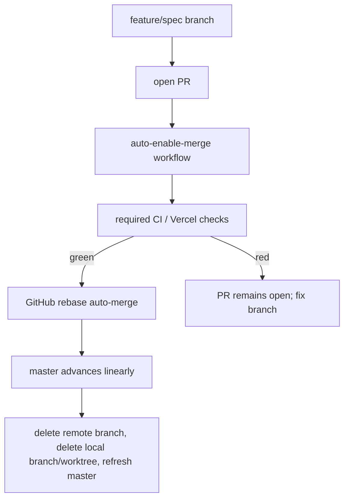

# AI-centric interactive resume - non-functional requirements

## Boundary

`non-functional-requirements.md` covers how this TypeScript resume app is built, tested, and maintained, including the contributor toolchain, repository command contracts, code-architecture discipline, release discipline, and contributor-workflow scenarios. User-facing product behavior belongs in `spec.md`; browser, data, AI, and MCP contracts belong in `contracts.md`; runtime and architecture constraints visible to users or deployers belong in `constraints.md`; user-facing acceptance examples belong in `scenarios.md`.

The project intentionally adopts livespec fleet discipline without depending on livespec fleet repositories; the standalone rule is defined once in `constraints.md` §"Standalone boundary". Requirements in this file MUST be implemented with standalone TypeScript, Svelte, Bun, Vercel, GitHub, and local repository tooling unless a future proposed change explicitly adds a dependency.

## Spec

### Livespec governance

The repository MUST remain livespec-first. Product, contract, constraint, and non-functional changes MUST flow through livespec proposed changes and revisions before implementation work relies on them. Implementation work MUST treat the accepted specification as authoritative and MUST update it before or with any behavior change.

The project MUST dogfood the livespec Codex driver and the git-jsonl orchestrator. Work items SHOULD be tracked through the selected orchestrator once the repository is ready for implementation planning.

### Guardrail provisioning boundary

Many gates in this file become mandatory "before the first non-trivial implementation merge". That phrase MUST be interpreted concretely rather than left as an undefined window: the *first non-trivial implementation merge* is the first change that lands first-party product source under `src/**` (the product-source set defined in §"Mechanically enforced Red -> Green commit protocol") on `master`, whether by a pull-request merge or a sanctioned direct-owner commit. Commits that only add or change the guardrail harness/tooling, specifications, documentation, or governed data snapshots are real work but are NOT the first non-trivial implementation merge.

The guardrail harness MUST be provisioned ADDITIVELY ahead of that boundary: each gate is enforced from the commit that first introduces its own artifact onward, and there is NO bootstrap-mode window in which a present gate is left unenforced. Every gate this file requires "before the first non-trivial implementation merge" MUST be present, operational, and green as a precondition of that first `src/**` product merge. Sequencing the harness so each gate's introducing commit already satisfies it — keeping the build additive rather than circular — is an implementation-planning concern owned by the standalone repository's guardrail-implementation plan, not a spec-level bootstrap flag or a retroactive exemption. Because provisioning is additive and correctly ordered, no gate needs to bootstrap against itself, and "before the first non-trivial implementation merge" is a determinate precondition rather than an ambiguous phase.

### Discipline adoption inventory

Before implementation planning claims the livespec fleet discipline has been adopted, the repository MUST maintain a local discipline-adoption inventory at `.ai/discipline-adoption.md`. The root `AGENTS.md` index MUST reference that file once it exists, per §"Local memory guardrails".

The inventory MUST contain a table with at least these columns: discipline, source inspiration, disposition, enforcement class, local enforcement artifact, aggregate-check coverage, and notes. The disposition value MUST be exactly one of adopted, locally adapted, deferred, or rejected. The enforcement class MUST be exactly one of gate-enforced, process-enforced, documented-only, or none.

Gate-enforced rows MUST cite a local TypeScript, Svelte, Bun, Vercel, GitHub, hook, or CI command/workflow that fails when the practice is violated. Process-enforced rows MUST cite a committed workflow artifact, such as a pull request convention, work-item record, or commit-evidence convention, that records the practice and is checked by a local or CI gate for presence and shape even when the practice's historical ordering cannot be reconstructed from a single final tree. Documented-only rows MAY cite documentation, but MUST NOT be described as enforced and MUST record why no gate or process-enforcement mechanism exists. Deferred and rejected rows MUST use enforcement class none, state the reason, and state the condition for revisiting the decision.

The inventory MUST include baseline rows for every seed-listed discipline: TDD, livespec-dev-tooling-inspired shared guidelines, applicable livespec ecosystem tooling, GitHub CI and pull-request discipline, release discipline, top-of-pyramid E2E discipline, linting, fuzzing and property checks, local memory guardrails, standalone dependency boundaries, Bun/Vitest/Playwright/Svelte/SvelteKit/Vercel toolchain discipline, and git-jsonl work-item workflow. The TDD row MUST use enforcement class gate-enforced, citing the mechanically-enforced Red -> Green commit protocol in §"Test-Driven Development discipline"; the `applicable livespec ecosystem tooling` row MUST cite the §"Livespec ecosystem tooling adoption" enumeration.

The inventory MUST preserve the standalone boundary: adopted discipline MAY be inspired by sibling livespec repositories, but runtime code, tests, CI, hooks, build scripts, and deployment MUST NOT require sibling checkouts, Python-only fleet tooling, or non-committed local state. `bun run check` MUST verify that `.ai/discipline-adoption.md` exists before the first non-trivial implementation merge, that it contains the baseline rows above, that each row uses an allowed disposition and enforcement class, that gate-enforced rows cite existing runnable local commands, hooks, or workflows, that process-enforced rows cite existing committed workflow evidence, work-item records, or pull-request/commit conventions checked for presence by a local or CI gate, and that documented-only rows are not counted or described as enforced.

The locally adopted livespec-dev-tooling-inspired shared guidelines are the committed local rules in this file, not an implicit dependency on a sibling checkout. The baseline row for livespec-dev-tooling-inspired shared guidelines MUST cite this section and map at least these local guidelines to their local enforcement artifacts: one aggregate check command as the single gate; the exit-code baseline for repository-owned CLIs; Result/ROP error-flow discipline; hermetic no-network property/fuzz checks for broad input spaces; pinned and reproducible TypeScript/Svelte/Bun/Vercel tooling; local memory guardrails; and the standalone dependency boundary. Any additional guideline inspired by livespec-dev-tooling MUST be enumerated here or in an indexed `.ai/*.md` note before the inventory may mark it adopted or locally adapted.

### Livespec ecosystem tooling adoption

The seed requires adopting all applicable livespec fleet and ecosystem tooling discipline. Because an `applicable livespec ecosystem tooling` inventory row would otherwise be unfalsifiable, this file MUST enumerate each seed-relevant livespec ecosystem tool or practice considered for this standalone TypeScript/Svelte app, and the discipline-adoption inventory's `applicable livespec ecosystem tooling` row MUST cite this enumeration rather than a generic undefined row. Each enumerated entry MUST carry a disposition (adopted, locally adapted, deferred, or rejected), an enforcement class per §"Discipline adoption inventory", a local TypeScript/Svelte/Bun/Vercel realization or an explicit standalone-boundary rejection, and the aggregate-check or doctor/static hook that enforces it when one is required.

The enumerated ecosystem practices MUST include at least: the livespec Codex driver and its `/livespec:*` surface; the livespec CLI lifecycle (`seed`, `propose-change`, `critique`, `revise`, `doctor`); the doctor static and LLM-driven checks; the git-jsonl work-item workflow and its `capture-*` / `implement` front-ends; the proposed-change and revision file discipline under `SPECIFICATION/`; and any fleet-only Python enforcement tooling that is intentionally NOT adopted because the standalone boundary (`constraints.md` §"Standalone boundary") forbids a runtime or check-time dependency on it. A rejected fleet-only entry MUST name the local standalone mechanism that replaces it.

### Test-Driven Development discipline

Behavioral implementation work MUST follow Red -> Green -> Refactor. A feature or fix changeset MUST include a failing test that demonstrates the missing behavior before the implementation turns it green. Refactors MUST preserve the existing green suite.

For UI behavior, the preferred red test is a Playwright test that observes user-visible behavior. A lower-level integration test MAY support the red test, but it MUST NOT replace the required Playwright mapping for a load-bearing functional scenario in `SPECIFICATION/scenarios.md`. For pure data transforms, search, grounding, and contract logic, the preferred red test is a Vitest unit or property test.

#### Mechanically enforced Red -> Green commit protocol

TDD is `gate-enforced`, not merely process-enforced by an evidence record: Red -> Green ordering MUST be enforced mechanically by a standalone TypeScript/Bun adaptation of the livespec fleet's `red_green_replay` commit-msg gate. The adaptation MUST reproduce the fleet mechanism's semantics in the local Bun/Vitest/Playwright toolchain and, per `constraints.md` §"Standalone boundary", MUST NOT import or shell out to livespec's Python enforcement suite. Enforcement is evidence-triggered by an explicit TDD intent selected by the `tdd-commit` helper (or by the same machine-readable `TDD-Intent` trailer when a contributor intentionally bypasses the helper), the staged diff shape, the relevant test outcome, and the checksummed `TDD-*` trailers; the commit subject prefix MUST NOT be the discriminator. `TDD-Intent` MUST be exactly one of `Red`, `Green`, or `Suite-Green`. A missing, unknown, or conflicting `TDD-Intent` marker MUST reject before any Red, Green, or Suite-Green evidence is accepted, so the hook has exactly one deterministic leg for the staged tree. A valid Red -> Green sequence yields a single commit carrying the anchor test, the implementation and any supporting test files, and structured, checksummed commit-message trailers that are the concrete, durable TDD evidence artifact. As in the fleet's proven Python and Rust practice, a single commit MAY touch many files: the protocol checksums exactly one designated *anchor* test, not a manifest of every staged test artifact.

- **Red leg.** When the explicit TDD intent selects Red, exactly one *anchor* test file — the test that specifies the new behavior — is staged ALONE, with the implementation left unmodified, and committed. A commit-msg hook runs the staged anchor test (Vitest for non-browser behavior, Playwright for browser-observable behavior); it MUST fail meaningfully — an assertion failure, not an import or collection error. Supporting test-only infrastructure the anchor test needs in order to load (fixtures, page objects, component harnesses, snapshots, helper modules) MUST already exist, committed earlier via the Suite-Green leg, so the Red failure is a real assertion rather than a missing-import error. On a valid Red the hook records the trailers `TDD-Red-Test` (anchor test path), `TDD-Red-Failure-Reason`, `TDD-Red-Test-File-Checksum` (a `sha256:<hex>` digest of the anchor test-file bytes), `TDD-Red-Output-Checksum` (a `sha256:<hex>` digest of the test output), and `TDD-Red-Captured-At` (UTC ISO-8601). A Red-intent staged anchor test that already PASSES MUST be rejected as an invalid Red moment.
- **Green leg.** The implementation is staged and the commit is amended. A single feature MAY touch many implementation files and MAY additionally stage supporting or updated test files (sibling tests, fixtures, snapshots) in this amend; only the recorded anchor test is constrained. The hook MUST recompute the anchor test file's SHA-256 and reject the Green unless it is byte-identical to the recorded `TDD-Red-Test-File-Checksum` (changing the anchor test requires authoring a new Red commit), MUST re-run the anchor test and require it to pass, and MUST record `TDD-Green-Verified-At` and `TDD-Green-Parent-Reflog`. The final single commit therefore carries the anchor test, all implementation files, and any supporting test artifacts. On the amend the `TDD-Intent` marker MUST flip from `Red` to `Green`: the durable Red -> Green commit carries exactly one `TDD-Intent: Green` marker alongside the full `TDD-Red-*` and `TDD-Green-*` trailer sets, and the persisted `TDD-Red-*` trailers are the required Red evidence, not a second intent. For reference, the transient pre-amend Red commit carries `TDD-Intent: Red` with only the `TDD-Red-*` trailers, and a Suite-Green commit carries `TDD-Intent: Suite-Green` with only the `TDD-Suite-Green-*` trailers. A "conflicting `TDD-Intent`" that MUST reject is more than one distinct `TDD-Intent` value on a single commit; the coexistence of `TDD-Red-*` and `TDD-Green-*` trailers under a single `TDD-Intent: Green` is the required durable shape, not a conflict.
- **Suite-Green leg.** A behavior-preserving change that introduces no new failing test — a refactor, a chore touching first-party product source, or a passing test-only cleanup — MUST select Suite-Green intent, pass the FULL suite against the staged tree (a clean exit only; a zero-test run MUST reject), and record `TDD-Suite-Green-Scope`, `TDD-Suite-Green-Output-Checksum` (`sha256:<hex>`), and `TDD-Suite-Green-Captured-At`. A pure refactor or chore that changes first-party product source and stages no test file passes the commit-level pairing gate only through this Suite-Green evidence plus the per-file coverage gate; it MUST fail if it lacks valid Suite-Green trailers or if coverage for the changed source file is absent.

The per-commit commit-msg hook makes the gate work for both direct-owner commits to `master` and pull-request branches — it fires before the commit lands, so it does not depend on a non-empty `master`-vs-branch diff. It MUST be complemented by a branch-range validation that `bun run check` and CI run over `origin/master..HEAD`: every non-merge commit touching first-party product source MUST carry EITHER the `TDD-Red-*` / `TDD-Green-*` pair shape OR the `TDD-Suite-Green-*` shape, and its single `TDD-Intent` value MUST match that shape — the pair shape MUST carry `TDD-Intent: Green` and the Suite-Green shape MUST carry `TDD-Intent: Suite-Green` — so a final amended commit has exactly one valid interpretation and a rebase, squash, or history rewrite cannot launder a commit past the per-commit hook. An unresolvable range base — for example a shallow CI checkout — MUST fail the check actionably rather than silently pass. The repository MUST provide a `tdd-commit` helper command that mechanizes the stage-anchor-test-alone -> commit -> stage-implementation -> amend sequence as a single invocation for Red -> Green work, and also provides a Suite-Green mode for refactors, chores, and passing test-only cleanups. Source-to-test pairing follows the fleet's proven model rather than a per-source checksum: the commit-level pairing gate MUST require any Red -> Green commit that changes first-party product source to also stage at least one test file, and the per-file coverage gate in §"Test coverage expectations" MUST ensure every first-party source file is actually exercised. The location convention for a source file's primary test is one of — a co-located `*.test.ts` / `*.spec.ts` beside the module, a mirror path under a `tests/` or `e2e/` tree, or, for a `src/routes` route, page, or Svelte component whose behavior is browser-observable, a Playwright scenario mapped per §"Top-of-pyramid discipline" — any of which satisfies the pairing. Pure refactors, documentation-only changes, spec-only revisions, generated artifacts, dependency lockfile refreshes, and mechanical formatting-only changes are exempt from the Red -> Green pair requirement — they take the Suite-Green leg — when the exemption is explicit and machine-checkable. This protocol is the `gate-enforced` mechanism the discipline-adoption inventory's TDD row MUST cite.

For this protocol, *first-party product source* means repository-authored implementation files under `src/**` that ship into the SvelteKit browser or server runtime or implement first-party product logic, including the `src/data`, `src/domain`, `src/search`, `src/grounding`, `src/mcp-contracts`, `src/adapters`, `src/server`, `src/api`, `src/routes`, `src/components`, and `src/lib` subtrees when present. Test files, Playwright scenarios, fixtures, snapshots, generated SvelteKit artifacts, generated types, built assets, dependency lockfiles, specifications, documentation, governed data snapshots under `data/**`, and repository harness/tooling are OUT of the first-party product-source set for the TDD pairing and branch-range gates. Repository harness/tooling includes bootstrap scripts, aggregate-check and gate scripts, git hooks, `.github/workflows/**`, lint/format/typecheck/coverage/Vercel/Svelte/Bun configuration, package-manager metadata, and branch-protection/settings verification. Harness/tooling still MUST be covered by its own tests or checks when `bun run check` claims those gates are operational, but it does not require Red -> Green product-source pairing unless a future proposed change explicitly brings a harness subtree into the product-source set.

### Top-of-pyramid discipline

Every load-bearing `## Scenario:` heading in `SPECIFICATION/scenarios.md` MUST be classified as either **browser-observable** or **non-browser-exercisable** and MUST carry a top-level test mapping appropriate to its class before it is treated as implemented:

- A **browser-observable** scenario — one whose Given/When/Then describes user-visible behavior in the running app — MUST map to at least one Playwright end-to-end test identifier. Integration and unit tests MAY provide additional supporting evidence, but they MUST NOT replace the Playwright mapping for a browser-observable scenario.
- A **non-browser-exercisable** scenario — a data, build/prerender, or tooling invariant that has no faithful browser rendering, such as governed-data import/transform, DOM-free search projection, malformed-data build failure, or pinned-inventory round-tripping — MUST instead map to at least one existing test of a named non-Playwright top-level category (a Vitest unit or integration test, a `fast-check` property/fuzz test, or a build/prerender check), and its mapping MUST record that category and a one-line rationale for why a Playwright mapping would be misleading.

This classification applies to the EXISTING phase-1 scenario set, not only to future scenarios. A phase-1 scenario that is inherently non-browser — for example `Search projection is generated without a browser DOM`, `Malformed governed data is rejected at load` under the build-time load, or `Committed governed source round-trips the pinned production inventory` — MUST be recorded as non-browser-exercisable with its replacement category and rationale rather than forced onto a misleading Playwright mapping. The non-browser class is NOT an escape hatch for behavior a visitor can see: when a load-bearing scenario is genuinely browser-observable, the Playwright mapping remains mandatory.

Later-phase or non-load-bearing scenarios are excluded from the mapping requirement until a future proposed change activates them. A future functional scenario that is genuinely not browser-exercisable MUST be marked non-browser-exercisable by the same proposed change that adds or revises it, using the same classification above (named replacement category plus the misleading-Playwright rationale).

The repository MUST maintain a scenario coverage mapping in committed configuration or data; that mapping is where each scenario's browser-observable-versus-non-browser-exercisable class and its test identifiers are recorded, so this classification need not be inlined into `SPECIFICATION/scenarios.md` prose. The aggregate check MUST verify that every load-bearing scenario carries a mapping of its declared class — a resolvable Playwright test identifier for a browser-observable scenario, or a resolvable non-Playwright test identifier of the recorded category plus rationale for a non-browser-exercisable scenario — that every mapped test identifier resolves to an existing test, that later-phase scenarios are excluded until activated, that no browser-observable scenario is mis-declared as non-browser-exercisable to dodge Playwright, and that missing, stale, or mis-typed mappings fail the check.

This coverage gate applies only to `SPECIFICATION/scenarios.md`. Scenarios in this file's own "Scenarios" section are contributor-workflow scenarios and are satisfied by repository and CI configuration (for example, a required GitHub check wired to the aggregate check command), not by Playwright tests.

### Definition of done for implementation work

An implementation change is not done until the aggregate check command passes locally or the remaining failure is explicitly documented as external to the change. The aggregate check MUST include Svelte and TypeScript validation, linting, format checks, unit tests, integration tests when present, Playwright end-to-end tests, coverage gates, the mechanically-enforced Red -> Green commit-protocol gate in §"Test-Driven Development discipline", property-based or fuzz-style tests required by §"Fuzzing and property checks", the Result/ROP enforcement gates in §"Result and railway-oriented programming discipline", the scenario coverage mapping gate in §"Top-of-pyramid discipline", and any spec checks introduced by the project. Vercel production and preview constraints MUST remain satisfied before merge.

## Contracts

### Contributor toolchain

The preferred toolchain is TypeScript with Svelte and SvelteKit, Bun for package management and script execution, Vitest for unit and integration tests, Playwright for browser end-to-end tests, and Vercel for deployment via the SvelteKit Vercel adapter. The repository MUST pin tool versions or otherwise document the version-selection mechanism so a fresh checkout can reproduce the same checks.

Svelte-specific validation is load-bearing. The local toolchain MUST include `svelte-check` or a documented equivalent, Svelte-aware linting including accessibility diagnostics, the Svelte compiler diagnostics surfaced by the normal build path, and the SvelteKit production build using the Vercel adapter. Any substitute command MUST document the coverage it provides before it replaces one of these checks.

### Aggregate command

The canonical aggregate check command is `bun run check`. It MUST be non-mutating and MUST run the checks required by "Definition of done for implementation work", including the mechanically-enforced Red -> Green commit-protocol gate before implementation work is claimed merge-ready. A `just check` wrapper MAY additionally be provided, but it MUST only delegate to `bun run check`. CI and hooks MUST delegate to the aggregate command or to documented subcommands rather than embedding divergent tool invocations.

### Package script categories

Before the first non-trivial implementation merge, the repository MUST provide these command categories, each exposed as a named Bun script (or a documented stricter equivalent):

| Command category | Required behavior |
|---|---|
| Bootstrap | Install pinned dependencies and local hooks. |
| Dev server | Run the SvelteKit app locally. |
| Build | Produce the Vercel-deployable SvelteKit production build through the Vercel adapter. |
| Typecheck | Run TypeScript checks plus `svelte-check` or its documented equivalent. |
| Lint and format | Check style, Svelte-aware lint rules, accessibility diagnostics, and formatting, with separate mutating fix commands. |
| Unit tests | Run fast Vitest unit tests. |
| Integration tests | Run non-browser integration tests when present. |
| End-to-end tests | Run Playwright scenarios against the app. |
| Coverage and property checks | Enforce documented coverage thresholds and deterministic property/fuzz tests. |
| Scenario coverage | Verify load-bearing scenario-to-Playwright mappings. |
| Aggregate check | Run all required non-mutating checks. |

The required Bun script surface MUST name at minimum `check`, `bootstrap`, `dev`, `build`, `typecheck`, `lint`, `format:check`, `test:unit`, `test:e2e`, `test:coverage`, `test:property`, `check:scenarios`, `check:result`, `check:memory`, and `tdd-commit`, or documented stricter equivalents that each record the coverage the substitute provides. `bun run check` MUST verify that every required script exists in `package.json`, that the `bootstrap` script installs the committed local hooks, and that CI delegates to these named scripts rather than embedding divergent tool invocations per §"Aggregate command".

### Exit-code baseline

Repository-owned CLIs and scripts that expose explicit process status MUST use this baseline unless a narrower tool's convention is documented:

| Code | Meaning |
|---|---|
| `0` | success |
| `1` | internal bug or unexpected tool failure |
| `2` | usage error or invalid command invocation |
| `3` | precondition failure such as missing environment, missing dependency, or invalid project state |

### GitHub CI and pull request discipline

GitHub CI MUST run the aggregate check for pull requests before merge. Pull requests SHOULD also validate the Vercel build path. Production-promotion workflows MUST be explicit and MUST NOT rely on undocumented local state.

The repository MUST carry `.github/workflows/check.yml` before implementation work is claimed merge-ready. That workflow MUST run on `pull_request` events targeting `master` and on pushes to `master`. It MUST install the pinned Bun/toolchain versions, install dependencies from the lockfile, install or cache Playwright browser dependencies, and run `bun run check` without embedding divergent check logic.

The required CI status check name for the aggregate check MUST be documented in the workflow or adjacent repository documentation and MUST be the name branch protection requires before pull-request auto-merge is claimed operational. If the Vercel preview/build validation is supplied by Vercel's GitHub integration rather than a repository-owned workflow, the expected Vercel status check name MUST be documented. If preview validation is repository-owned instead, the repository MUST carry a documented workflow such as `.github/workflows/preview.yml` that builds through the SvelteKit Vercel adapter and exposes a stable status-check name.

### Release and Vercel promotion discipline

Changes MAY reach `master` through direct owner commits or through the pull-request path defined in §"Pull request landing automation". Every commit that lands on `master` SHOULD use a Conventional Commit subject, and spec revise commits SHOULD follow the repository's `chore(spec): cut vNNN — <summary>` pattern.

A production-impacting release is compliant only when the aggregate check passes, the SvelteKit production build succeeds through the Vercel adapter, and a Vercel preview or documented local equivalent validates the changed app surface before production promotion. The repository MUST document how production deployment is triggered for direct `master` commits and pull-request merges. Environment-variable changes MUST be reviewed against `contracts.md` §"Environment contract" and §"Vercel environment discipline" before promotion.

Production-impacting changes MUST carry enough rollback guidance for the change type: either a plain Git revert path, a Vercel rollback/promotion path, or a documented explanation that rollback is not applicable. Semantic versioning and changelog generation are not required for this personal resume app unless a future proposed change activates release artifacts beyond Git history and Vercel deployments.

### Pull request landing automation

Changes MAY land either by the repository owner committing directly to `master`, or through a pull request. Direct owner commits to `master` are a sanctioned path — the repository owner's standing preference — not an emergency-only exception. For changes that go through review, the repository targets an automated pull-request landing path so a green pull request lands without a manual merge/push sequence: branch -> pull request -> required checks -> rebase auto-merge -> cleanup.

The pull-request path MUST be fully gate-enforced — branch protection, the auto-enable-merge workflow, and settings verification — before the first non-trivial implementation merge, rather than remaining aspirational or provisioned-only-on-demand. Full gate-enforcement does not remove the sanctioned direct-owner-commit path: because the aggregate-check workflow (§"GitHub CI and pull request discipline") runs on pushes to `master` as well as on pull requests, a direct owner commit is still gated by the same aggregate check post-push, and a red `master` is caught rather than shipped silently. Branch protection MUST therefore require the aggregate-check status for the pull-request merge path and enforce rebase-only linear history while still permitting the repository owner's direct pushes — it MUST NOT require a pull request for every change. The discipline-inventory `GitHub CI and pull-request discipline` row MUST be `gate-enforced`, citing `.github/workflows/check.yml`, `.github/workflows/auto-enable-merge.yml`, and the repository-local branch-protection and settings verification.

For the pull-request path, the repository settings MUST allow rebase merge and MUST disable squash merge and merge commits, and the `master` branch MUST require linear history. This preserves every commit's Conventional Commit subject and avoids merge commits in the public history.

Before the first non-trivial implementation merge, the `master` branch MUST have branch protection configured so the repository's full CI/check set is required before a pull request merges. Branch protection MUST apply to administrators for the linear-history and merge-method rules and MUST NOT enable GitHub's `strict` / require-branches-up-to-date setting: with `gh pr merge --auto`, strict mode can update a behind pull request by merging `master` into the branch, which violates linear history. Rebase merge already replays the pull request on the current `master` tip at merge time, and any semantic conflict is caught by the required checks on `master` after landing.

Before the first non-trivial implementation merge, the repository MUST carry `.github/workflows/auto-enable-merge.yml`. The workflow MUST trigger on pull request `opened`, `reopened`, `ready_for_review`, `synchronize`, and `unlabeled` events. It MUST skip draft pull requests and pull requests labeled `do-not-merge`. For eligible pull requests from the repository owner or an explicit allowlist of trusted automation identities, it MUST enable rebase auto-merge by running `gh pr merge "$PR" --repo "$REPO" --auto --rebase`. The workflow MUST use a short-lived GitHub App installation token minted at runtime, not `GITHUB_TOKEN`, because enabling pull-request auto-merge requires permissions that `github-actions[bot]` does not reliably have. The repository MUST document and provision the required secrets `APP_ID` and `APP_PRIVATE_KEY` before claiming the workflow is operational.

The repository MUST NOT add an auto-update-branches workflow or any equivalent mechanism that merges `master` into open pull-request branches. Behind pull requests are handled by rebase auto-merge at merge time, not by pre-merge branch-update commits.

The expected pull-request landing sequence is:



Before the first non-trivial implementation merge, the aggregate check command MUST include a repository-local verification that `.github/workflows/check.yml` and `.github/workflows/auto-enable-merge.yml` exist and that branch-protection and merge-method settings are documented; live GitHub API verification via `gh` MAY additionally run when credentials are available. Any such local or live check MUST fail when required branch protection, linear history, the required aggregate-check status, or auto-merge workflow wiring is absent or misconfigured.

### Local memory guardrails

Repository automation and agent workflows MUST NOT persist private local memories in hidden tool state. Agent-facing local notes, when needed, MUST live under `.ai/*.md` and MUST be referenced from the root `AGENTS.md` index with their purpose.

The allowed committed private-note pattern is `.ai/*.md`; every such file MUST be referenced from the root `AGENTS.md` index. Private memory or hidden tool-state paths are prohibited unless an explicit repository policy documents a narrower path as ordinary project configuration rather than memory.

The prohibited committed path set MUST include `.claude/**`, `.codex/**`, `.cursor/**`, `.continue/**`, `.aider*`, hidden memory databases, chat transcripts, prompt transcripts, and tool cache directories.

The seed calls out hooks as the mechanism that prevents private local memories from entering commits, so before the first non-trivial implementation merge this guardrail MUST be BOTH hook-enforced and aggregate-enforced. The repository MUST carry a committed, reproducible hook configuration installed by the bootstrap command (per §"Package script categories") whose hook blocks any commit that adds a prohibited private-memory or hidden tool-state path, an `.ai/*.md` file not indexed from `AGENTS.md`, or an `AGENTS.md` reference to a missing `.ai` note. The aggregate check MUST run the same guard so CI catches a bypassed or uninstalled hook. If the project intentionally ships no such bootstrap-installed hook, this file MUST record that as a seed deviation and name the replacement enforcement mechanism.

## Constraints

### TypeScript quality gates

TypeScript MUST run in strict mode. Linting and formatting MUST be enforced with TypeScript-native and Svelte-aware tools selected by the implementation. The linter configuration MUST include rules or repository-local checks that catch unused code, unsafe promises, accidental `any`, import disorder, unreachable code, test-only leakage into production bundles, and Svelte accessibility issues surfaced by the chosen Svelte linting stack.

The lint and format baseline MUST be pinned concretely enough to be enforceable rather than left to unspecified implementer choice. The repository MUST enforce type-aware ESLint using `typescript-eslint` strict-type-checked rules (or a documented stricter equivalent), Svelte-aware linting with accessibility rules enabled, formatting checked through Prettier (or an explicitly stricter formatter), zero lint warnings in CI (a warning MUST fail the aggregate check), import-order and first-party import-boundary rules, and Bun-appropriate dependency-hygiene checks. `bun run check` MUST assert that the committed configuration enables each of these rule families and MUST fail when the lint or format configuration drops below this baseline. Any exception MUST name the affected rule family, why the stricter equivalent is acceptable, and the condition for revisiting it.

The committed TypeScript configuration MUST enable at least `strict`, `noImplicitOverride`, `noUncheckedIndexedAccess`, `exactOptionalPropertyTypes`, and `useUnknownInCatchVariables`. If a flag cannot be enabled, the exception MUST be documented in this file or adjacent committed tooling documentation with the reason, affected files, and condition for removing the exception.

SvelteKit generated route and load types, including `$types` modules, MUST be checked through `svelte-check` or a documented equivalent. Test-only type allowances MUST be isolated from the production TypeScript configuration so production code cannot rely on relaxed test settings. `bun run check` MUST fail when the committed TypeScript or Svelte configuration drops below this baseline.

The aggregate check MUST run strict TypeScript validation, `svelte-check` or its documented equivalent, Svelte-aware linting, formatting checks, Vitest, Playwright, the SvelteKit production build through the Vercel adapter, and the repository-local Red -> Green commit-protocol, scenario, coverage, fuzz/property, and Result/ROP gates required by this file.

### Result and railway-oriented programming discipline

The repository MUST define or adopt a typed `Result` object with `Ok<T>` and `Err<E>` variants and helper composition functions for `map`, `mapErr`, `andThen`/`bind`, asynchronous composition, and exhaustive narrowing. The exact library or in-repo implementation MAY be chosen by the implementation, but the public shape MUST be documented in this file before use. A minimal documented shape is:

```typescript
type Result<T, E> =
  | { ok: true; value: T }
  | { ok: false; error: E };

type AsyncResult<T, E> = Promise<Result<T, E>>;
```

The exported names MAY differ, but the abstraction MUST expose a discriminated success/failure object rather than exceptions or nullable values for expected failures.

The discipline MUST distinguish expected domain failures from bugs:

| Category | Examples | Required routing |
|---|---|---|
| Domain error | invalid resume data, missing governed item, no search matches represented as a data outcome, AI provider unavailable, malformed provider response, unsupported MCP request, missing environment variable, rate limit, network timeout | `Err<DomainError>` on the Result track |
| Bug | impossible branch, type mismatch, null dereference, broken invariant, unhandled discriminant, programmer misuse of a dependency | thrown exception caught only by an outer supervisor or error boundary |

First-party public functions in core modules for resume data parsing, normalization, date formatting, markdown-to-text conversion, search, filtering, sorting, citation construction, grounding, AI response validation, and MCP contract shaping MUST return `Result<T, DomainError>` for synchronous logic. First-party public functions that perform asynchronous expected-failure work MUST return `Promise<Result<T, DomainError>>` or a documented `AsyncResult<T, DomainError>` alias. UI component event handlers MAY return framework-native `void` when they only dispatch to Result-returning application services and handle both variants before updating UI state.

Boundary adapter modules that call browser or server runtime APIs, network, storage, Vercel facilities, AI providers, or future MCP transports MUST convert only enumerated expected failures into `DomainError` variants. A blanket `catch (error) { return err(...) }` outside approved boundary adapters MUST be forbidden, because it hides bugs as recoverable failures. Boundary adapters MAY catch unknown values only to classify them as expected provider or runtime failures after checking their type or shape; otherwise they MUST rethrow.

`DomainError` MUST be a discriminated union with stable `kind` strings and structured, non-secret context. It MUST NOT be a single catch-all `Error`, string, `unknown`, or nullable sentinel. User-facing errors MUST be derived from `DomainError.kind` through the presentation mapper required by `contracts.md` §"Error payloads", which strips secrets, prompts, stack traces, filesystem paths, and raw provider payloads.

The intended layer split is:

```text
src/data|domain|search|grounding|mcp-contracts  -> pure Result<T, DomainError>
src/adapters|server|api                          -> AsyncResult<T, DomainError>, enumerated expected catches
src/routes|components                            -> unwrap Result, render success/error states, no raw provider errors
```

The aggregate check command (§"Aggregate command") MUST enforce this discipline mechanically with TypeScript, ESLint, or repository-local AST checks. The gates MUST include: public API Result typing in the selected first-party core directories; no ignored `Result`/`AsyncResult` return values; no floating promises; exhaustive switches over `DomainError.kind`; no blanket catch outside approved adapters and supervisors; no throwing `DomainError` as an exception; and no direct rendering of raw `Error` or provider payloads to visitors. Per `constraints.md` §"Standalone boundary", these checks MUST use local TypeScript/Bun/Vercel-compatible tooling and MUST NOT import livespec's Python enforcement suite.

### Test coverage expectations

Before the first non-trivial implementation merge, the repository MUST document explicit line, branch, and function coverage thresholds and `bun run check` MUST enforce them. The thresholds MUST clear committed, non-trivial floors so the gate cannot be satisfied with near-zero coverage merely by keeping core numerically above glue: first-party core logic (resume data parsing, normalization, markdown-to-text projection, search/filter/sort, citation construction, answer-grounding logic, and MCP contract shaping) MUST meet at least 90% line, 90% function, and 85% branch coverage, and framework glue MUST meet at least 60% line coverage, unless a documented stricter equivalent raises the bar. `bun run check` MUST fail when any committed threshold is set below its floor, and MUST fail when the first-party-core thresholds are not strictly higher than the framework-glue thresholds on every dimension. Any module exempted from a threshold MUST carry a documented rationale and a revisit condition in committed configuration or this file, and an exemption MUST NOT drop a first-party-core module below the core floor without naming the specific exception. The exact percentages are a low-level realization that MAY be tuned through a future proposed change as the harness is built, but the committed floor MUST remain non-trivial and MUST keep core strictly above glue.

### Fuzzing and property checks

The seed's fuzzing discipline is locally adapted for the TypeScript/Svelte implementation as deterministic property-based testing over both valid-domain and malformed/adversarial input classes. A separate random fuzzer is not required in phase 1 unless a future proposed change adds one, but malformed and adversarial parse/normalize/strip cases MUST be represented in the property generators for the targets below so the fuzzing dial is not discharged by happy-path generators alone.

Pure parsing, normalization, markdown-to-text projection, search, filtering, sorting, citation, grounding, and MCP contract modules MUST have deterministic property-based tests, fuzz-style tests, or both when the input space is broader than a few fixed examples. These tests MUST run through the aggregate check, MUST use Bun/Vitest-compatible tooling, and MUST run without network access. Any intentional exemption MUST be documented next to the module or in this file with a rationale.

For reproducibility, property and fuzz tests MUST use `fast-check` or a documented stricter Bun/Vitest-compatible equivalent, and the aggregate check MUST fail when the required reproducibility metadata is absent. Each property target MUST run with a fixed or logged seed in CI and expose a local replay command that re-runs a failed seed deterministically; declare committed minimum run counts for a fast local mode and a deeper CI mode; capture shrunk counterexamples in failure logs; and provide generator suites that explicitly classify valid-domain, malformed, adversarial, boundary, and legacy-compatibility inputs so the malformed/adversarial portion cannot silently collapse into happy-path generation.

Phase 1 MUST include property-based or fuzz-style tests for these targets: governed YAML parse/transform rejection; stable item and section slug derivation, including collision suffixes; markdown and HTML syntax stripping for search; date parse, render, and sort edge cases; deterministic search/filter/sort composition; and visitor-safe presentation mapping from `DomainError`. Later AI or MCP activation MUST add property-based or fuzz-style tests for grounding, citation construction, AI response validation, and MCP contract shaping before those surfaces become load-bearing.

### Hooks

Local hooks SHOULD run fast checks before commit and the aggregate check before push when practical. Hooks MUST be reproducible from committed configuration. Hooks that enforce local memory guardrails are required once `.ai/*.md` notes or prohibited-memory patterns are introduced.

### Vercel environment discipline

Environment variables MUST be documented by name, purpose, environment class, and whether they are required for local, preview, or production use. Production secrets MUST be stored in Vercel or another managed secret store, never in the repository.

### Dependency discipline

Runtime dependencies MUST be justified by product behavior. Development dependencies MUST support the standalone TypeScript toolchain per `constraints.md` §"Standalone boundary".

## Scenarios

### Scenario: Discipline inventory proves local adoption

Given the project claims a livespec fleet discipline practice is adopted

When a contributor reviews `.ai/discipline-adoption.md`

Then the inventory classifies every seed-listed discipline as adopted, locally adapted, deferred, or rejected, assigns an enforcement class, and names the standalone TypeScript/Svelte/Bun/Vercel/GitHub mechanism or evidence convention required by that class

### Scenario: Livespec ecosystem tooling adoption is enumerated

Given the project claims applicable livespec ecosystem tooling is adopted

When a contributor reviews the "Livespec ecosystem tooling adoption" enumeration and the discipline inventory's applicable-ecosystem row

Then each enumerated ecosystem practice carries a disposition, an enforcement class, and a local realization or explicit standalone-boundary rejection, and the inventory row cites the enumeration rather than a generic undefined row

### Scenario: Scenario coverage gate protects acceptance behavior

Given a load-bearing scenario is added to `SPECIFICATION/scenarios.md`

When the implementation claims that scenario is complete

Then the scenario coverage mapping classifies it as browser-observable or non-browser-exercisable and links it to at least one existing test of the matching class — a Playwright identifier for browser-observable, or a named non-Playwright category identifier plus rationale for non-browser-exercisable — and `bun run check` fails on a missing, stale, mis-typed, or class-dodging mapping (for example a browser-observable scenario declared non-browser-exercisable to avoid Playwright)

### Scenario: Aggregate check is the single local quality gate

Given a contributor has installed the documented toolchain

When they run the aggregate check command

Then Svelte validation, TypeScript validation, linting, formatting, tests, Red -> Green commit-protocol enforcement, coverage, property/fuzz gates, Result/ROP enforcement gates, discipline-inventory checks, and scenario coverage checks run through one documented entry point

### Scenario: Required package-script surface exists

Given the repository approaches its first non-trivial implementation merge

When the aggregate check command runs

Then it fails unless every required Bun script name exists in `package.json`, the bootstrap script installs the committed hooks, and CI delegates to the named scripts rather than embedding divergent commands

### Scenario: TDD Red -> Green protocol is mechanically enforced

Given a commit changes first-party product source without valid Red -> Green checksummed-trailer evidence or valid Suite-Green evidence, amends a Green leg after the anchor test file's bytes changed, or supplies a missing, unknown, or conflicting `TDD-Intent` marker

When the commit-msg hook fires or the `origin/master..HEAD` range validation in the aggregate check runs

Then the commit is rejected — or the branch range fails — unless it deterministically selects one TDD leg via its single `TDD-Intent` marker and carries the `TDD-Red-*` / `TDD-Green-*` pair shape under `TDD-Intent: Green` or the `TDD-Suite-Green-*` shape under `TDD-Intent: Suite-Green`, with the anchor-test checksum matching the recorded Red-leg digest even when the commit also stages other implementation and test files

### Scenario: TypeScript configuration cannot weaken silently

Given the committed TypeScript or Svelte configuration disables a required strictness flag, omits generated SvelteKit type checking, or lets test-only allowances affect production code

When the aggregate check command runs

Then the TypeScript quality gate fails unless a documented exception covers the deviation

### Scenario: Lint and format baseline cannot drop silently

Given the committed lint or format configuration drops below the pinned TypeScript/Svelte baseline, or CI is configured to tolerate lint warnings

When the aggregate check command runs

Then the lint/format gate fails unless a documented substitute records rule-equivalent coverage for each required baseline rule

### Scenario: Result discipline gate rejects unchecked error flow

Given first-party core code ignores a `Result` return value, floats a promise, uses a blanket catch outside an approved adapter, or renders a raw provider error to visitors

When the aggregate check command runs

Then the Result/ROP enforcement gate fails the check before merge

### Scenario: Coverage and property gates protect core logic

Given first-party parser, normalization, search, filtering, citation, grounding, or MCP contract code lacks required coverage or a required property/fuzz test

When the aggregate check command runs

Then the coverage or property/fuzz gate fails before merge unless a documented exemption applies

### Scenario: Coverage thresholds cannot drop below the committed floor

Given the committed coverage thresholds set a first-party-core dimension below its non-trivial floor, or set the core thresholds no higher than the framework-glue thresholds on some dimension

When the aggregate check command runs

Then the coverage gate fails before merge unless a documented stricter-equivalent or a named per-module exemption with a revisit condition covers the deviation, and a first-party-core module is never dropped below the core floor without naming the specific exception

### Scenario: Property and fuzz checks are reproducible

Given a first-party property or fuzz target lacks a fixed or logged seed, a replay command, committed run counts, shrink capture, or the required valid/malformed/adversarial/boundary generator classes

When the aggregate check command runs

Then the property/fuzz reproducibility gate fails before merge unless a documented exemption applies

### Scenario: GitHub CI exposes required status checks

Given the repository claims pull-request CI discipline is operational

When a pull request targets `master`

Then the documented GitHub workflow runs `bun run check`, exposes the required aggregate-check status name, and any documented Vercel build or preview status is available for branch protection

### Scenario: Preview deployment validates a pull request

Given a pull request changes product behavior

When CI and Vercel preview checks run

Then the aggregate check passes and the preview deployment renders the changed resume app before merge

### Scenario: Production promotion is gated

Given a change can affect the production resume site

When the change is prepared for promotion

Then the aggregate check, SvelteKit Vercel build, preview validation, environment-variable review when applicable, and rollback guidance are complete before production promotion

### Scenario: Pull request lands automatically after required checks pass

Given a trusted contributor opens a non-draft pull request without the `do-not-merge` label

When the auto-enable-merge workflow runs and the required CI and Vercel checks pass

Then GitHub rebase-merges the pull request to `master` without a manual local merge or direct push

### Scenario: Red pull request cannot land

Given a pull request has failing required checks

When GitHub evaluates mergeability for `master`

Then branch protection blocks the merge until the required checks pass

### Scenario: Pull-request discipline is provisioned before implementation

Given the repository approaches its first non-trivial implementation merge

When the aggregate check command runs

Then it fails unless branch protection requires the aggregate-check status with rebase-only linear history, `.github/workflows/check.yml` and `.github/workflows/auto-enable-merge.yml` exist, and the branch-protection and merge-method settings are documented, while the sanctioned direct-owner-commit path remains gated by the on-push aggregate check

### Scenario: Guardrail gates are provisioned additively before the first product-source merge

Given the repository is standing up its guardrail harness and a change is about to land the first first-party product source under `src/**` on `master`

When the aggregate check command runs against that change

Then it treats that change as the first non-trivial implementation merge and fails unless every gate this file requires before the first non-trivial implementation merge is already present, operational, and green — each such gate having been enforced from the commit that introduced its own artifact onward, with no bootstrap-mode window in which a present gate was left unenforced — while harness/tooling, spec, documentation, and governed-data commits that precede it are not themselves treated as the first non-trivial implementation merge

Given a committed file matches a prohibited private-memory pattern, an `.ai/*.md` note is missing from `AGENTS.md`, or `AGENTS.md` references a missing `.ai` note

When the local memory guardrail hook or aggregate check runs

Then the check fails unless the path is documented as ordinary tool configuration rather than private memory

### Scenario: Local memory guardrail hook is installed and enforced

Given the repository is prepared for its first non-trivial implementation merge

When a contributor runs the bootstrap command and then attempts to commit a prohibited private-memory path, an unindexed `.ai/*.md` note, or a dangling `AGENTS.md` reference

Then the committed, bootstrap-installed hook blocks the commit and the aggregate check independently fails so a bypassed or uninstalled hook is still caught, unless the project has recorded a documented seed deviation naming the replacement enforcement
